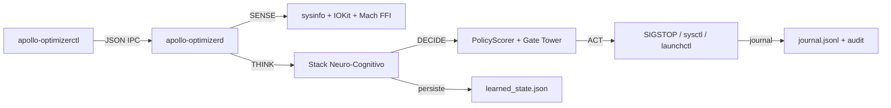

# apollo-silicon-reactor


**apollo-silicon-reactor** (antes `apollo-optimizer`) es un daemon autónomo de optimización de sistema diseñado para **macOS Apple Silicon, baseline M1 8 GB**. Rust puro, sin Python, sin shell scripting en el hot loop. No es un gestor de procesos genérico — es un agente adaptativo con 9 fases de aprendizaje cableadas que redistribuye CPU, RAM y headroom térmico según la intención real del usuario en lugar del scheduler "justo" por defecto de XNU.

El reactor aprende. Cada ciclo observa ~400-600 procesos vivos, puntúa acciones candidatas a través de un stack neuro-cognitivo (razonamiento NARS, grafo causal, scorer de políticas asimétrico, agente RL, modulador de presencia de usuario), commitea su rationale a un journal auditable, y revierte o refuerza sus propios parámetros aprendidos según el score AIS de calidad que sigue.

## Por qué existe

Las laptops macOS Apple Silicon con 8 GB de RAM viven en un techo constante de presión de memoria. El scheduler de XNU es agnóstico al workload y optimiza para fairness, no para intención — cuando estás a mitad de build, Spotlight reindexando le gana ciclos de CPU a `rustc`. apollo-silicon-reactor cierra ese loop con un agente que sabe qué proceso querés responsivo ahora mismo, aprende de sus propios errores, y revierte cualquier optimización que eligió y que terminó dañando AIS.

## Cualidades

- **Adaptativo, no reactivo** — 22+ parámetros aprendidos auto-tuneados por workload; sin thresholds estáticos en el hot path
- **Causalmente honesto** — descuenta su propia contribución 30% cuando un confounder exógeno (throttle térmico, spike de red) fue la causa real del efecto observado (Pearl 2009)
- **Auto-reversible** — si un shift de parámetro aprendido baja la calidad AIS bajo 0.35, el policy-rollback guard restaura el `pre_value` automáticamente (Sutton & Barto 2018 §11.7)
- **Scorer asimétrico** — el policy scorer puede OVERRIDE un gate-accept (dirección segura), pero nunca tiene permitido override un gate-reject (dirección insegura)
- **Consciente de presencia** — modulador de tres tiers (idle / semi-active / active) lee HID idle, HID event rate, sleep assertions y actividad de audio para decidir qué tan agresivo ser; bypassea la politeness a `pressure ≥ 0.65` por supervivencia
- **Consciente de batería** — penaliza acciones con muchos wakeups cuando está en batería (proxy de costo energético); silencioso con cargador
- **Hot path lock-free** — 11 contadores atómicos ARMv8.1 publican telemetría sin contención de mutex (Hellerstein 2012)
- **Auditable** — cada acción ejecutada adjunta un `Rationale { action_class, trigger, evidence, expected_outcome }` al journal para análisis post-hoc
- **Safety-first** — 13 invariantes enforced mecánicamente en `safety.rs`; procesos protegidos (Antigravity, Claude, Brave, rustc, system services) nunca pueden ser congelados
- **Deploys disciplinados** — guard de 3 gates exige evidencia de test-diff + baseline pre-snap + sanity check post-90s (AIS ≥ 87) antes de permitir un swap de binario

## Arquitectura

Workspace Cargo, tres binarios, IPC vía Unix socket con JSON tagueado:

| Binario | Rol | Lifecycle |
|---|---|---|
| `apollo-optimizerd` | Daemon root long-running | Servicio `launchd`, estado en `/var/lib/apollo/` |
| `apollo-optimizerctl` | Cliente CLI + dashboard TUI live | Conecta a `/var/run/apollo-optimizer.sock` |
| `apollo-optimizer` | CLI one-shot (`snapshot`, `optimize`, `restore`, `llm`) | Proceso por invocación |



El hot loop del daemon está descompuesto en ~30 módulos `tick` independientes (patrón Strangler Fig). Trabajo por ciclo acotado; sin I/O bloqueante en el hot path; los lock guards se sueltan antes de cualquier syscall.

## Sistema Cognitivo

11 contadores LSE lock-free publican end-to-end vía `runtime_metrics.json`. Cada contador corresponde a una fase de aprendizaje cableada. Contadores que leen 0 no son bugs — están wired-dormant por diseño hasta que su trigger se dispare (arousal Crisis, transición térmica, disagreement scorer/gate, etc).

| Fase | Contador | Propósito |
|---|---|---|
| Skill-Aware Prediction | `skill_aware_modulations_total` | Pondera skills de prueba por success rate histórico por workload |
| Arousal-Based Decay | `arousal_decay_accelerations_total` | Crisis flushea creencias NARS más rápido (McGaugh 2004) |
| Companion Graph | `companion_cross_group_inferences_total` | `P(proc \| fg_app)` direccional vía normalización Lift |
| Adaptive Drift Threshold | `adaptive_drift_threshold_raises_total` | Varianza online Welford, sensibilidad a drift auto-calibrada |
| Causal External Blame | `causal_external_thermal_blames_total` | Descuenta impact score 0.30 cuando hay confounder térmico |
| Policy Rollback | `policy_rollback_evaluations_total` | Revierte parámetros aprendidos cuando AIS quality < 0.35 |
| User Presence | `user_presence_suppressions_total` | Modulador 3-tier idle/HID/sleep con bypass a pressure≥0.65 |
| Battery-Aware Cost | `battery_aware_penalty_emissions_total` | Penaliza ruido de wakeup/ctx-switch en batería |
| Journal Rationale | `journal_rationales_attached_total` | Adjunta metadata de razonamiento basada en evidencia a cada acción |
| Scorer Override Reject | `scorer_override_rejects_total` | Cutover asimétrico ±0.30 — scorer puede BLOQUEAR gate-accepts |
| Scorer Disagreement | `scorer_disagreement_strong_accepts_total` | Loguea gate-rejects que el scorer quería aceptar (nunca override) |

### Fundamento académico

- **Pei Wang (2013)** — Razonamiento No-Axiomático, revisión TruthValue, forgetting Bayesiano
- **Pearl (2009 §3)** — Confounder adjustment, geometría de descuento por external-blame
- **Sutton & Barto (2018 §11.7)** — Corrección model-free de políticas, auto-revert por drop de calidad
- **Hellerstein et al. (2012)** — Control por feedback de sistemas computacionales, contadores lock-free en hot paths
- **Nygard (2018)** — Release It! patrones de resiliencia, circuit breakers, patrón bulkhead
- **Lakshminarayanan (2017)** — Incertidumbre predictiva simple y escalable, composición RSS
- **McGaugh (2004)** — Arousal emocional acelera consolidación/decay de memoria
- **Welford (1962)** — Varianza online para thresholding adaptativo

## Invariantes de seguridad

`safety.rs` las enforcea mecánicamente; bypassearlas es imposible desde fuera del módulo.

- **Nunca freezear**: `kernel_task`, `launchd`, `WindowServer`, `Spotlight (mds)`, `configd`, `Antigravity`, `Claude`, `Brave/Chromium*` (contrato IPC de Brave), `rustc` / `cargo` durante builds activos
- **Cascade bypass**: `user_presence_modulator` devuelve `1.0×` (optimización total) cuando `memory_pressure ≥ 0.65`, sin importar actividad HID o sleep assertion — supervivencia le gana a politeness UX
- **Scorer asimétrico**: PolicyScorer puede BLOQUEAR un gate-accept (dirección segura) pero NUNCA tiene permitido override un gate-reject (dirección insegura)
- **Modo supervisión** (`CLAUDE.md`): ningún trabajo declarado "completo" sin re-verificación mecánica de `runtime_metrics.json` + re-lectura adversarial del diff + sample size N≥500

## Quick start

```bash
# Build (release: target-cpu=native, LTO, panic=abort)
cargo build --release

# Instalar como daemon root (cp codesign-preserving a /usr/local/libexec, bootstrap de launchd)
sudo ./scripts/install-root-daemon.sh

# Status + salud cognitiva
apollo-optimizerctl status

# Dashboard TUI live (rendering diferencial 4-10Hz, zero flicker)
apollo-optimizerctl dashboard

# Snapshot one-shot
apollo-optimizer snapshot --output system_snapshot.json

# Desinstalar + restaurar
sudo ./scripts/uninstall-root-daemon.sh
```

## Disciplina de deploy

`scripts/apollo-deploy-gate.sh` enforcea tres gates antes de cualquier swap de binario:

1. **Gate 1 — Evidencia de test**: HEAD (o branches mergeadas vía `git log -3 --no-merges`) debe agregar/modificar al menos un `#[test]`. La Regla de Desobediencia de `CLAUDE.md`: primero escribís el test que falla.
2. **Gate 2 — Pre-snapshot**: captura `runtime_metrics.json` + count de ciclos + AIS antes del swap.
3. **Gate 3 — Post-snapshot (90s)**: piso de AIS ≥ 87.0, failures = 0, `last_error = None`, ciclos progresando. Si no, el script alerta fuerte. Rollback se sugiere, nunca se ejecuta — decide el humano (regla de supervisión).

```bash
./scripts/apollo-deploy-gate.sh --dry-run   # solo gates 1+2, sin deploy
./scripts/apollo-deploy-gate.sh             # deploy guarded completo
```

El swap de binario usa `sudo cp` para preservar el flag linker-signed (NO usar `python3 open().write()` — strippea el codesign y dispara Launch Constraint Violation).

## Layout del repo

```
src/                         # Binario CLI (apollo-optimizer)
src/bin/apollo-optimizerd/   # Daemon root (long-running)
src/bin/apollo-optimizerctl/ # Cliente CLI + dashboard TUI
crates/apollo-engine/        # Librería del engine cognitivo
  src/engine/                # Lógica de decisión, NARS, grafo causal, scorer
  tests/                     # Tests de integración (level3_*)
scripts/                     # install/uninstall/deploy-gate
.cargo/config.toml           # target-cpu=native, LTO
CLAUDE.md                    # Doctrina del proyecto (modo supervisión, anti-patrones)
```

## Development

```bash
cargo test                              # Suite completa (~2100 tests de lib)
cargo test --doc                        # Doctests
cargo test engine::nars                 # Filtro por módulo
cargo clippy --all-targets              # Lint
cargo fmt --all                         # Format
```

Evitá correr múltiples comandos `cargo` concurrentes — compiten por el directorio `target/` compartido.

## Licencia

Ver `LICENSE` (TBD).
