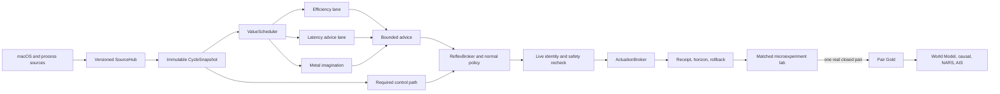

# Apollo Option C: Value, Evidence, and Heterogeneous Runtime

**Status:** Frozen design contract

**Date:** 2026-08-13

**Goal:** Make Apollo spend optional compute where it has the highest measured value, use Apple Silicon heterogeneously without inventing hardware claims, and let autonomous experiments teach the system only through real paired evidence.

## Decision

Apollo adopts Option C as an integrated control architecture with four strict authority levels:

1. **Observe:** one immutable, versioned cycle snapshot describes what Apollo knew.
2. **Allocate:** a bounded value-per-cost scheduler decides which optional computation deserves time.
3. **Advise:** CPU reasoning, Metal imagination, World Model, NARS, Markov, MPC, and causal models may rank or refine already-valid candidates.
4. **Act and learn:** `ReflexBroker`, normal safety, identity checks, `ActionQueue`, `ActuationBroker`, receipts, rollback, and paired real outcomes remain authoritative.

No model, GPU result, scheduler permit, synthetic counter, or successful rollback can create an action, Gold evidence, or AIS credit by itself.



## Non-Negotiable Invariants

- Safety, release, rollback, kill-switch handling, sleep/wake recovery, urgent unfreeze, PID identity checks, and action ownership are never optional or value-scheduled.
- Missing, stale, invalid, non-finite, or mismatched evidence is neutral for acceleration advice and conservative for harmful actions.
- Metal is ranking-only. It cannot invent, veto, execute, or close an action.
- macOS QoS expresses `efficiency`, `default`, or `latency` intent. Apollo never claims literal E-core/P-core affinity or residency.
- ANE/Core ML is disabled in v1 because Apollo has no fixed, versioned model with a CPU oracle. Raw AMX probing is outside this architecture.
- A runtime counter, GPU simulation, model counterfactual, unpaired endpoint, foreign/imported state, or rollback-only event cannot become Pair Gold or AIS evidence.
- AIS weights remain unchanged. A higher score must be earned by better measured inputs.
- Every queue, registry, history, string, payload, scan, and per-cycle completion path is explicitly bounded.

## Cycle Contract

```mermaid
sequenceDiagram
    participant Loop as Main loop
    participant Hub as SourceHub
    participant Snap as SnapshotPublisher
    participant Sched as ValueScheduler
    participant Lane as Optional lanes
    participant Safety as Broker and safety
    participant Lab as Experiment lab

    Loop->>Loop: Preempt stop, restore, release, interrupts
    Loop->>Hub: Load each source exactly once
    Loop->>Snap: Publish one immutable snapshot
    Loop->>Safety: Required decisions with same snapshot
    Loop->>Sched: Plan optional jobs under current budget
    Sched-->>Loop: JobPermits, never actions
    Loop->>Lane: Latest-wins bounded requests
    Lane-->>Loop: Identity-bound advice or terminal failure
    Loop->>Safety: Fresh live recheck before mutation
    Safety-->>Lab: Receipt, endpoint, horizon, rollback facts
    Lab-->>Loop: Bronze/Silver or one Pair Gold
```

The phase order is:

1. Preempt and restore.
2. Sense required sources.
3. Build one coherent observation.
4. Publish once.
5. Run required decisions and lease maintenance.
6. Select and submit optional work.
7. Act through existing authority.
8. Account, close evidence, and publish metrics.
9. Wait using the existing adaptive cycle floor.

## Cycle Snapshot

### Identity

```rust
pub struct SnapshotId {
    pub daemon_epoch: u64,
    pub sequence: u64,
}

pub enum ObservationStatus {
    Fresh,
    Stale,
    Unavailable,
    Invalid,
    Truncated,
}

pub struct SourceObservation<T> {
    pub value: Option<T>,
    pub generation: u64,
    pub revision: u64,
    pub age_us_at_cut: u64,
    pub status: ObservationStatus,
}
```

`CycleSnapshot` is immutable after publication and carries snapshot ID, cycle, monotonic cut times, workload identity, capability revision, thermal/power revision, compact pressure/thermal/interaction fields, and source status. It may reference the existing scalar `SystemSnapshot` during migration, but it may never claim absent source metadata is fresh.

The v1 publisher holds only the latest `Arc<CycleSnapshot>`. Optional requests retain at most one `Arc`; results copy only bounded advice. Live snapshots are never persisted.

### Freshness

| Source | Fresh through | Conservative behavior when stale or absent |
| --- | ---: | --- |
| Pressure and VM flow | 10 s | No new harmful process action based on nominal pressure |
| Thermal and power | 20 s maximum | No discretionary accelerator admission |
| Process identity census | 10 s | No harmful target admission; verified release remains available |
| Foreground and interaction | 6 s | Treat foreground-dependent target as protected/unknown |
| Battery/power source | 30 s | Use the lower optional-work budget |
| Optional advice | 2 snapshot revisions maximum | Drop advice; deterministic path continues |

Every asynchronous result must match daemon epoch, snapshot ID, workload, capability revision, thermal/power revision, and deadline. A mismatch is an observed drop, never a fallback value.

## Value Scheduler

The `ValueScheduler` owns optional compute admission only. It returns `JobPermit`; it never owns closures, models, effects, or actions.

### Bounds

```text
MAX_JOBS                  = 64
MAX_SELECTED_PER_CYCLE    = 16
MAX_DEPENDENCIES_PER_JOB  = 4
MAX_IN_FLIGHT_OPTIONAL    = 4
MAX_COMPLETIONS_PER_CYCLE = 64
MIN_COST_ESTIMATE_US      = 50
MAX_JOB_SLICE_US          = 60_000
NOMINAL_BUDGET_US         = 150_000
GUARDED_BUDGET_US         = 100_000
CONSTRAINED_BUDGET_US     = 60_000
```

`JobId` and descriptors are fixed enums/tables. No runtime string registry exists. At most one queued or running generation exists per job; a newer pending request replaces an older one.

### Value Function

All ranking arithmetic is deterministic bounded integer arithmetic:

```text
freshness_q  = min(10_000, elapsed_since_success * 10_000 / target_max_interval)
signal_q     = bounded job-specific signal or 0 when unavailable
starvation_q = min(10_000, consecutive_budget_skips * 1_000)

value_q = (4*base_value_q + 3*freshness_q + 2*signal_q + starvation_q) / 10
ewma_us = clamp((7*old_ewma_us + observed_us) / 8, 50, 60_000)
cost_us = max(static_floor_us, ewma_us, last_observed_us_clamped)
score_q = value_q * 1_000_000 / cost_us
```

Eligible jobs sort by score, freshness, oldest success, then `JobId`. Selection is one greedy pass under budget and capacity. This is intentionally `O(J log J)` for `J <= 64`, not a knapsack solver.

### Initial Jobs

V1 registers only existing, measurable optional work:

- `GpuImagination`
- `ReflexReasoningRefresh`
- `WorldModelRefresh`
- `AisRuntimeRefresh`
- `HardwarePrediction`
- `HoltWintersRefresh`
- `PageReclaimRefresh`
- `PlannerAdviceRefresh`
- `PeriodicLearningMaintenance`
- `TelemetryFlush`

Required user/audio/pressure/thermal safety sensing is not scheduled. Expensive assertion refresh may move to a background source only after its stale behavior is conservative and tested.

### Rollout

The scheduler starts in Shadow. Legacy cadence executes while the scheduler records what it would have selected. After 500 valid post-warmup cycles it may become Active only when:

- no protected target, identity, rollback, cycle, or daemon failures occurred;
- cycle p95 is below 75 ms and no more than 10% worse than baseline;
- apply/revert oscillation is no more than 10% worse than baseline;
- effective build/runtime profile matches the host;
- no optional job bypasses the registry;
- selection p95 is at most 250 us and maximum at most 1 ms.

Failure leaves it in Shadow with one exact blocker. Configuration can return it to legacy cadence without reinstalling.

## Heterogeneous Runtime

| Lane | QoS intent | Workers | Queue | Authority |
| --- | --- | ---: | --- | --- |
| Main control | inherited/default | 1 | none | final control owner |
| Efficiency sensing/features | utility | M1: 1, validated M4: up to 4 | latest-wins capacity 1 | observations/features only |
| Latency advice | default; user-initiated only for measured foreground interaction | 1 | latest-wins capacity 1 | proposals only |
| Metal imagination | Metal worker | 1 in flight | capacity 1 | bounded ranking only |
| Core ML/ANE | disabled | 0 | none | deferred-no-model |

Worker startup records requested QoS, returned status, expected workers, effective workers, and fallback reason. No metric reports core residency.

Metal retains the existing 24-candidate, 4096-sample, 10-second-cooldown envelope. V1 adds request identity, a monotonic 250 ms advisory deadline, finite/shape validation, and quarantine after a hard timeout or repeated command failures. The main loop never waits for Metal. Missing private GPU watts stays unknown; it is never coerced to zero. Public thermal, low-power, memory pressure, launch/fluidity, and Apollo-owned GPU-time budgets gate discretionary work.

Portable release artifacts must declare an M1-compatible CPU baseline. A native M4 build cannot be advertised as M1 portable. Deployment preflight rejects an unsupported baseline or capability/profile mismatch before replacing the installed binary.

## Microexperiment Lab

The existing `ExplorationScheduler` remains the safe candidate and reservation owner. A new `MicroexperimentLab` owns pairing and evidence closure; it does not execute effects.

### Closed Catalog

- Interaction QoS TTL variation on an already-real input-triggered lease.
- Markov cache-only prewarm versus matched no-prewarm.
- Background Boost versus matched safe omission.

Models may rank these arms but cannot add a fourth family or invent a candidate absent from the normal pipeline.

### Pair State

```rust
pub struct PairId(pub u128);

pub enum ArmKind { Control, Treatment }
pub enum ExecutionClosure { Applied, NoOp, Failed, Blocked }
pub enum HorizonClosure { Complete, Incomplete, Confounded, Expired }
pub enum RollbackClosure {
    Succeeded,
    NotRequiredNonKernel,
    Failed,
    IdentityGone,
    Interrupted,
}
pub enum EvidenceClosure { Bronze, Silver, PairGold }
```

Execution, horizon, rollback, and evidence are orthogonal facts. A successful rollback cannot overwrite the fact that a treatment was applied, and it cannot count as a useful adaptation.

Each pair has exactly one control and one treatment in deterministic balanced `AB` or `BA` order, the same family/action/horizon/coarse stratum, a washout, one complement lock, and one effect estimate. Each endpoint is Bronze or Silver. Two real local matched endpoints, complete horizons, no confounders, and verified rollback/non-kernel closure can emit exactly one Pair Gold record.

Null and harmful pair results are valid Gold knowledge but are not effective adaptations. They lower confidence honestly.

### Safety and Privacy

Mutable experiments are disabled unless explicitly configured. Unknown privacy state fails closed. Media, call, sleep assertion, build, secure input, screen/camera capture, sensitive context, non-nominal thermal state, pressure at least 0.55, hazard at least 0.30, degraded fluidity, circuit open, kill switch, or cognitive pause blocks admission. A mid-horizon transition cancels, rolls back when required, quarantines the pair, and prevents Gold.

No persisted lab state contains process names, paths, titles, media metadata, or raw telemetry.

### Persistence Bounds

```text
serialized lab state       <= 64 KiB
open pair records          <= 32
completed summaries        <= 128
Pair Gold/dedup IDs        <= 128
action key                 <= 96 bytes
workload/stratum           <= 32 bytes
active mutable endpoint    <= 1
rollback journal           <= 4 KiB and one active record
```

Open pairs never resume after restart. They become `InterruptedRestart` and cannot create Gold. Completed Pair Gold restores only for matching schema, installation, hardware, and origin.

### AIS Contract

- `learning_attributed_observations` counts distinct local authoritative Pair Gold IDs, not actuator Bronze totals.
- `learning_effective_observations` counts the Pair Gold subset whose measured effect crosses its declared utility threshold.
- Rollback success contributes to safety closure only.
- Markov hit/miss contributes to adaptation only inside a closed local pair whose objective agrees.
- Synthetic, GPU-imagined, model-counterfactual, unpaired, incomplete, foreign, duplicate, or rollback-only evidence contributes zero AIS credit.
- AIS weights do not change.

## Metrics

The dashboard exposes compact truth, with complete counters available in runtime metrics.

Scheduler:

- phase/readiness/blocker, registered/eligible/selected/in-flight jobs;
- budget/predicted/actual/select latency;
- selected/success/failed/cancelled/timed-out/stale and skip reasons;
- per-job bounded value, cost, score, terminal result, and success age.

Snapshot/runtime:

- epoch/revision, build/capture window, source age/status/skew;
- expected/compiled/effective workers, requested QoS, QoS failures, fallback reason;
- Metal submitted/completed/deadline/error/quarantine/validation outcomes.

Lab:

- proposed/eligible/randomized/control/treatment/horizon/rollback/Pair Gold;
- effective/harmful/confounded/interrupted/synthetic-quarantined;
- attribution and AIS admission counts derived from distinct IDs.

Legacy model support/promotions remain labeled support. They are never displayed as applied action or Pair Gold.

## Acceptance Matrix

### Scheduler and Snapshot

- Fixed unique acyclic registry; deterministic ranking independent of insertion order.
- NaN/inf/zero cost sanitize conservatively.
- Plans never exceed budget, 16 jobs, four dependencies, or four in-flight jobs.
- Latest-wins replacement, stale/wrong-epoch/wrong-workload/wrong-revision drops.
- Sleep/wake collapses missed intervals; kill switch admits zero optional work.
- Snapshot publication is immutable and revisions strictly increase.
- Concurrent readers observe whole old or whole new snapshots, never mixed fields.
- Missing pressure is not nominal; stale context cannot convert a reject into accept.
- Scheduler selection remains below 1 ms at all caps.

### Safety and Runtime

- Reflex Shadow behavior remains observational; Active veto/skip semantics remain unchanged.
- Releases and urgent unfreezes are never delayed.
- PID reuse, protected/Apple-owned targets, truncated census, and stale identity fail closed.
- M1 sequential fallback and validated M4 worker profile produce identical authoritative decisions.
- Worker spawn/QoS failure, queue saturation, panic/disconnect, Metal absence/error/hang, low power, thermal transition, and wake leave the main loop advancing.
- GPU output cannot create or execute an action or close learning.
- Deployment rejects profile/baseline/capability mismatch before swap.

### Experiments and AIS

- Exactly one control and one treatment; duplicate or mismatched arms reject.
- Assignment is deterministic, balanced, and independent of model score.
- Every safety/privacy boundary holds for the full horizon.
- Applied receipt, horizon, rollback, and evidence remain separate facts.
- Restart never resumes an open pair; recycled PID is never touched during rollback.
- Synthetic and advisory evidence cannot update Pair Gold, experimental causal learning, or AIS.
- Pair Gold requires two real local matched endpoints and emits once under duplicate/out-of-order callbacks.
- Null/harmful Gold is not effective.
- Promotion requires at least ten Pair Gold outcomes, a positive lower confidence bound, and two stable persisted windows.
- One pair changes Gold and AIS inputs at most once.

## Complexity and Overhead

- Scheduler: `O(J log J)` time and `O(J)` memory for `J <= 64`.
- Lab: `O(C + P)` bounded scans for at most 12 candidates and 32 open pairs.
- Snapshot pointer load/swap: `O(1)`; readers clone one `Arc`.
- Metal: one in flight, bounded candidates/samples, no production CPU Monte Carlo fallback.
- No unbounded histories, runtime registries, per-cycle label maps, catch-up bursts, or nested global pools.

## Explicitly Deferred

- Literal P-core/E-core pinning or residency claims.
- Core ML/ANE until Apollo owns a versioned model, feature schema, calibration corpus, and CPU oracle.
- Raw AMX opcodes or AMX-based scheduling/capability claims.
- Private SMC/IOReport/KPC signals as hard safety or deployment gates.
- GPU/ANE action authority, veto authority, Gold closure, or direct AIS credit.
- Persisting live snapshots or restoring hardware-dependent scheduler cost estimates.
- Converting every legacy cadence in the first deploy. V1 registers the bounded high-value jobs above and reports remaining bypasses before later cutover.

## Release Sequence

1. Add contracts, metrics, immutable snapshot identity, scheduler, and lab in Shadow.
2. Wire bounded existing jobs without changing authoritative actuation.
3. Correct experimental evidence provenance and AIS attribution.
4. Add truthful lane QoS/capability reporting and Metal deadline/failure handling.
5. Run focused tests, affected suites, adversarial review, workspace release suite, Clippy, E2E, and release build in one Cargo lane.
6. Run candidate preflight, deploy through the guarded path, and verify launchd plus fresh production metrics.
7. Treat fewer than 500 post-deploy samples as preliminary. Automatic Active cutover remains conditional on the frozen rollout gates.
