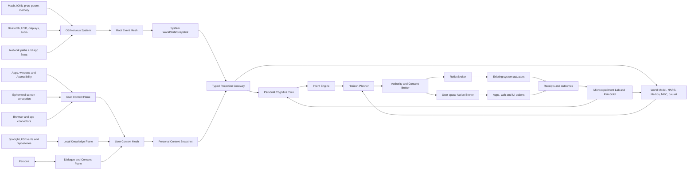
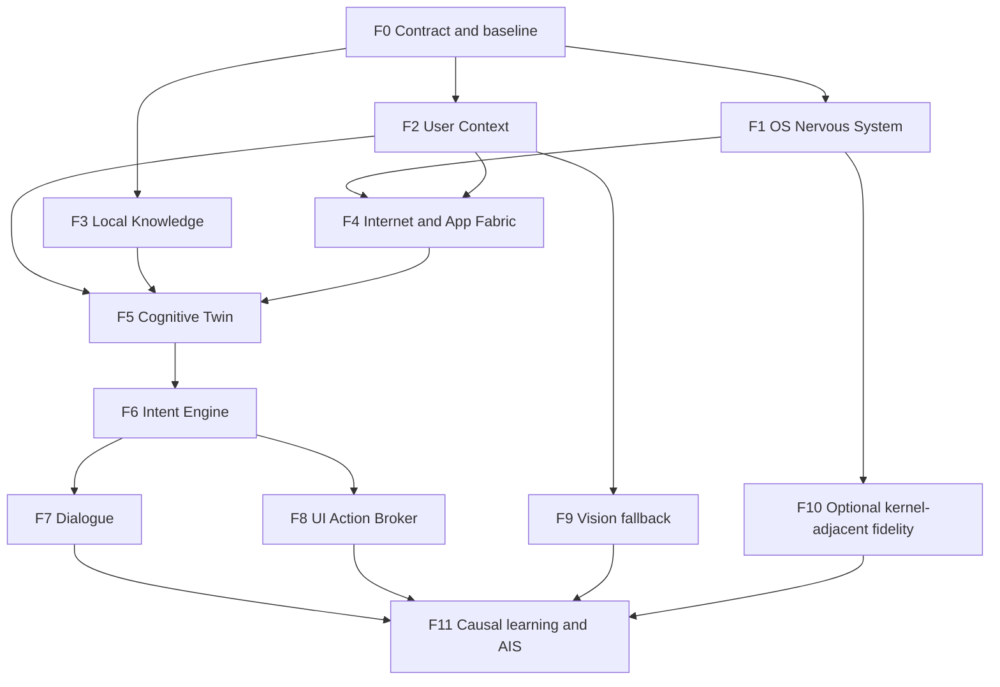

# Apollo Cognitive OS Companion

**Estado:** Especificacion canonica de arquitectura

**Nombre de trabajo:** Apollo 2.x Cognitive OS

**Relacion con documentos anteriores:** Esta especificacion envuelve y amplia `Apollo 2.0: Local Knowledge and Intent World Model`. El Local Knowledge Plane sigue siendo un subsistema obligatorio, no la arquitectura completa.

## 1. Vision

Apollo deja de definirse como un optimizador que observa CPU y memoria. Se convierte en una interfaz cognitiva local entre la persona y macOS:

`persona <-> Apollo <-> sistema operativo, aplicaciones, internet y dispositivos`

Debe comprender el estado tecnico del equipo, el contexto de trabajo, la continuidad de tareas y la intencion probable de la persona. Debe conversar, explicar, preparar y actuar con autoridad graduada. El optimizador actual permanece como la capa refleja de baja latencia.

La expresion "leer la mente" se implementa de manera verificable como:

- recordar metas y correcciones expresadas;
- reconocer episodios y patrones de trabajo;
- inferir una lista corta de siguientes acciones probables;
- declarar confianza, evidencia y contradicciones;
- preguntar cuando el costo de equivocarse sea alto;
- aprender del resultado sin atribuirse conocimiento inexistente.

Apollo nunca afirma conocer pensamientos privados. Predice intencion observable y permite que el usuario la corrija.

## 2. Que Significa Entender Todo el Equipo

"Todo" significa cobertura explicita de cada superficie soportada por APIs publicas, permisos concedidos y hardware presente. No significa acceso magico a datos que macOS, una aplicacion cifrada o un usuario no autoricen.

Para cada superficie Apollo debe mostrar uno de estos estados:

- `Verified`: productor y semantica comprobados;
- `Detected`: disponible, todavia sin suficiente evidencia operativa;
- `Degraded`: aporta informacion parcial o vieja;
- `PermissionDenied`: macOS o el usuario denegaron acceso;
- `Unsupported`: el sistema no expone esa capacidad;
- `Unavailable`: la capacidad deberia existir, pero su productor no responde;
- `Disabled`: fue apagada deliberadamente por politica.

Nunca se convierte `PermissionDenied`, `Unsupported` o `Unavailable` en un cero aparentemente sano. La cobertura se mide por dominio, fuente y frescura.

## 3. Objetivos

1. Construir un `WorldStateSnapshot` coherente del SO, sesion, tarea, aplicaciones, internet y perifericos.
2. Mantener un `Personal Cognitive Twin` local que represente tareas, preferencias, rutinas y correcciones.
3. Inferir intencion top-k con incertidumbre calibrada.
4. Conversar con el usuario sobre estado, planes, resultados y limites.
5. Preparar recursos antes de que sean necesarios sin inventar acciones.
6. Operar controles autorizados de macOS y aplicaciones con identidad, TTL, receipts y undo.
7. Aprender solo de outcomes medidos y Pair Gold locales.
8. Mantener el reflejo actual por debajo de su presupuesto de latencia incluso si todos los componentes cognitivos fallan.
9. Ser agnostico al chip mediante `CapabilityGraph`, no ramas permanentes M1/M4.
10. No depender de nube, LLM o acelerador para conservar las funciones sistemicas basicas.

## 4. Invariantes

1. El daemon root nunca recibe texto de documentos, contenido de pantalla, audio, teclas, titulos, URLs completas ni secretos.
2. Ningun sensor, parser, pagina web, documento o modelo puede actuar directamente.
3. Toda accion pasa por una autoridad unica, politica de consentimiento y ledger de efectos.
4. Todo resultado esta ligado a epoca, revision, identidad, fuente, permiso y antiguedad maxima.
5. Resultados viejos, incompletos, importados o de otra identidad son neutrales; no bloquean reflejos seguros ni autorizan acciones nuevas.
6. El contenido observado se considera datos no confiables, nunca instrucciones.
7. Las funciones cognitivas se degradan por componente; una falla no tumba el daemon.
8. La actividad interna, el uso de GPU/ANE y el numero de predicciones no elevan AIS.
9. Apollo no parchea el kernel, instala kexts ni usa APIs privadas como requisito.
10. Kill switch, sleep, cambio de sesion o revocacion de permiso invalidan trabajo pendiente.
11. Contenido humano, audio, frames, texto y embeddings no salen de la Mac; un proveedor generativo remoto queda fuera de esta arquitectura.

## 5. Arquitectura General



### 5.1 Doble Snapshot

Apollo mantiene dos espacios de estado ligados por la misma identidad temporal:

- `System WorldStateSnapshot`: vive en el daemon root y contiene estado tecnico, procesos y proyecciones opacas de contexto;
- `Personal Context Snapshot`: vive en el Companion Agent y contiene UI, tareas, conocimiento y dialogo autorizados.

El `Typed Projection Gateway` intercambia solo schemas permitidos. Hacia el usuario publica estado `SystemPublic`; hacia root publica clases, conteos, prioridades e intents opacos. Nunca transporta texto libre, paths, URLs completas, frames, audio o embeddings. Un hash o ID opaco no convierte contenido sensible en dato publico: conserva su clase de privacidad y TTL.

## 6. Fronteras de Procesos y Privilegios

### 6.1 `apollo-optimizerd`

Daemon root minimo y determinista. Es propietario de:

- telemetria sistemica privilegiada;
- `CapabilityGraph` autoritativo del host;
- Event Mesh raiz y snapshots opacos;
- reflejos de CPU, memoria, I/O, QoS y energia;
- proteccion de procesos;
- arbitraje final de acciones sistemicas;
- effect ledger, rollback y journal.

No posee conocimiento semantico del usuario ni automatiza UI.

### 6.2 `apollo-context-agent`

LaunchAgent de sesion, sensible a eventos y de baja latencia. Observa:

- ciclo de vida de aplicaciones;
- aplicacion frontal;
- ventanas, Spaces y displays;
- jerarquia Accessibility acotada;
- presencia e intensidad de interaccion;
- rutas de audio y estado de medios;
- estado de permisos TCC;
- cambios visuales agregados.

No indexa documentos ni mantiene memoria de largo plazo.

### 6.3 `apollo-knowledge-agent`

LaunchAgent de usuario para Spotlight, FSEvents, extractores, embeddings, Knowledge Store y Task Episode Graph. Aplica el Privacy Gate antes de abrir o persistir contenido.

### 6.4 `apollo-companion-agent`

LaunchAgent de usuario que aloja:

- Dialogue Plane;
- Personal Cognitive Twin;
- Intent Engine;
- Consent Broker visible;
- User-space Action Broker;
- memoria conversacional autorizada;
- explicaciones y correcciones.

Puede usar un modelo generativo local, pero la politica, la identidad y la autoridad permanecen deterministas. Los modelos remotos quedan fuera de esta arquitectura para preservar la frontera local de contexto humano.

### 6.5 Conectores

- extensiones de navegador para semantica web permitida;
- Native Messaging autenticado;
- conectores por API publica para aplicaciones compatibles;
- App Intents, Apple Events, Shortcuts y Accessibility como actuadores de usuario;
- extension Endpoint Security opcional y no obligatoria.

Cada conector tiene identidad de codigo, version, capacidades, permisos, presupuesto y circuit breaker independientes.

### 6.6 Autoridad Distribuida

La autoridad es unica como contrato, pero esta dividida por privilegio:

- `System Authority Broker` en root decide exclusivamente acciones sistemicas del catalogo existente;
- `User Authority Broker` en Companion Agent decide exclusivamente acciones de sesion, UI y aplicaciones;
- `Consent Broker` vive en usuario y solo entrega grants firmados para el dominio de usuario;
- root nunca ordena clicks, escritura o lectura de contenido;
- Companion Agent nunca ejecuta sysctl, signals privilegiadas o memorystatus.

Un plan mixto usa una saga con `DecisionId` comun. Cada broker reserva su lease, revalida su snapshot y publica receipt. Si una mitad falla, la otra cancela o ejecuta su compensacion declarada. Ningun broker interpreta el receipt del otro como permiso adicional.

## 7. Capability Graph 2

El grafo actual se amplia de una lista plana de hardware a un inventario versionado de sentidos, contexto, modelos y actuadores.

`CapabilityGraph` schema v2 eleva el limite duro de 64 a 192 nodos. No usa crecimiento ilimitado: IDs desconocidos se rechazan y cada dominio conserva un subcatalogo cerrado. Un lector v2 acepta schema v1 y materializa como `Unavailable` los nodos nuevos que no existian.

Cada nodo contiene:

- identificador estable;
- dominio y clase;
- estado;
- productor propietario;
- permiso requerido;
- precision y confianza observadas;
- latencia p50/p95;
- frescura maxima;
- capacidad o throughput;
- costo de CPU, memoria y energia;
- privacidad maxima que puede procesar;
- catalogo de acciones, si aplica;
- revision de schema y ultima verificacion.

Clases iniciales:

- `Compute`;
- `SystemSensor`;
- `SessionSensor`;
- `KnowledgeSource`;
- `InternetSource`;
- `HumanInput`;
- `ModelBackend`;
- `SystemActuator`;
- `UserActuator`;
- `Permission`.

El grafo expresa dependencias. Por ejemplo, `ScreenSemantics` puede usar Accessibility o Vision efimera; `UiControl` exige Accessibility, sesion desbloqueada, permiso activo y Consent Broker.

Los snapshots no convierten todo el catalogo en un vector plano. Conservan subviews tipadas y producen vectores `f32` acotados por modelo. Esto evita que ampliar percepcion infle cada ciclo o rompa `FEATURE_CAPACITY`.

## 8. OS Nervous System

Esta capa escucha el sistema operativo directamente desde user space y desde el daemon root cuando sea necesario. Usa eventos antes que polling y cachea consultas costosas.

### 8.1 Computo

- topologia logica de CPU y clases de rendimiento;
- intencion QoS, carga, run queue y saturacion;
- tiempo CPU por proceso y familia;
- GPU activa, tiempo y presion termica disponible;
- Core ML solicitado, backend efectivo y evidencia de ANE;
- Rosetta, arquitectura de procesos y traduccion;
- workers compilados, esperados, activos y bloqueados.

Apollo no promete afinidad fisica P/E. Expresa QoS y mide el resultado que macOS produjo.

### 8.2 Memoria

- memoria libre, wired, active, inactive y compressed;
- pressure, swap, page-ins/page-outs y compressor trend;
- footprint y crecimiento por proceso/familia;
- memorystatus disponible y resultados reales;
- riesgo OOM y velocidad de cambio;
- costo observado de purge, freeze, thaw y reclaim.

### 8.3 Energia y Termica

- AC/bateria, carga, salud y tendencia;
- Low Power Mode;
- potencia por paquete cuando exista fuente valida;
- estado termico y tiempo estimado a throttle;
- lid, sleep, wake, display sleep y power assertions;
- procesos con wakeups anormales;
- cambios de regimen por pantalla o bateria.

### 8.4 Procesos y Servicios

- exec, exit, fork y cambio de identidad observado;
- PID, start time, audit token y firma cuando aplique;
- familia de aplicacion y procesos auxiliares;
- launchd services visibles;
- sockets y recursos agregados sin payload;
- estado hung, suspended, throttled o protected;
- foreground/background y continuidad de workload.

La ruta base usa APIs publicas de proceso, Mach, kqueue y NSWorkspace. Endpoint Security solo mejora fidelidad de lifecycle cuando exista entitlement; nunca bloquea la arquitectura.

### 8.5 Almacenamiento y Filesystem

- volumen, montaje/desmontaje y disponibilidad;
- capacidad y presion de disco;
- throughput, latencia y cola de I/O;
- FSEvents dentro de raices autorizadas;
- Spotlight incremental;
- descargas, builds y escrituras como clases agregadas;
- Time Machine y Spotlight como actividades protegidas.

### 8.6 Red e Internet

- path disponible, tipo de interfaz, costo y restriccion;
- cambios Wi-Fi/Ethernet/hotspot/VPN;
- DNS y conectividad como estado, no contenido;
- latencia, retransmision, throughput y congestion agregados;
- flows por proceso cuando una API publica o Network Extension autorizada lo permita;
- WebFlow para navegacion semantica de navegadores conectados;
- NetworkFlow para aplicaciones sin conector semantico.

Apollo nunca realiza MITM TLS, instala certificados raiz ni inspecciona payload cifrado. Para aplicaciones sin API, comprende costo, fase y familia del flujo, no el contenido.

### 8.7 Dispositivos y Perifericos

- Bluetooth encendido/apagado/no autorizado;
- aparicion, conexion y desconexion de perifericos autorizados;
- clase de dispositivo: audio, input, wearable, phone, storage u other;
- ruta de audio y cambio de salida/entrada;
- USB y Thunderbolt connect/disconnect, clase y potencia agregada;
- volumen externo y disponibilidad local;
- topologia de displays, resolucion, refresh y HDR cuando sea publico;
- impresora, camara y microfono presentes o en uso sin capturar contenido;
- bateria de periferico cuando el framework lo exponga.

Nombres y direcciones de dispositivos se mantienen en el agente de usuario y se convierten a identidades opacas antes de entrar al daemon.

## 9. User Context Plane

### 9.1 Aplicaciones y Sesion

- login, logout, lock y unlock;
- aplicacion iniciada, terminada, activada u ocultada;
- bundle family opaca;
- ventanas visibles, minimizadas, fullscreen y display/Space;
- foco y transiciones entre familias;
- actividad media, llamada o screen sharing;
- Focus mode y notificaciones solo cuando APIs publicas y permisos lo permitan.

### 9.2 Semantica de Interfaz

Accessibility es el sensor principal. El agente reduce la jerarquia a un snapshot acotado:

- rol y subrol;
- enabled, focused, selected y expanded;
- acciones soportadas;
- geometria cuantizada;
- clase semantica: editor, navegador, terminal, dialogo, formulario, timeline o media;
- presencia de password/secure field;
- revision de la jerarquia y elemento enfocado.

Texto, labels y valores permanecen en el agente de usuario. Solo rasgos y clases opacas cruzan al daemon.

### 9.3 Percepcion Visual Efimera

ScreenCaptureKit es fallback, no sensor primario. Se activa solo con permiso explicito y cuando Accessibility no describe suficiente contexto.

Reglas:

- muestreo impulsado por cambios, no video continuo;
- maximo 2 frames por segundo y normalmente menos de 0.2 fps;
- regiones de interes, no display completo cuando sea posible;
- Vision/Core ML local para layout, cambio y clase de actividad;
- frame descartado inmediatamente despues de producir rasgos;
- ningun frame, OCR o thumbnail en disco, logs o daemon;
- cero captura durante lock, secure input, password field o denylist;
- aplicaciones y ventanas pueden marcarse `never-capture`;
- circuit breaker por CPU, GPU, memoria, energia o permiso.

### 9.4 Entrada Humana

Apollo observa presencia, no contenido de teclas:

- idle time;
- frecuencia agregada de HID;
- mouse/trackpad/keyboard como clase activa;
- ritmo de interaccion y pausas;
- correcciones, aceptaciones, undo y cancelaciones emitidas a Apollo.

Quedan prohibidos keylogging, almacenamiento de coordenadas crudas, clipboard global silencioso y captura de contrasenas.

### 9.5 Personal Context Gateway

El contexto humano no se limita a actividad de teclado. Un gateway separado puede incorporar, siempre con permiso por fuente:

- hora local, zona horaria y calendario laboral;
- eventos proximos de Calendar reducidos a tiempo, duracion y clase;
- Reminders activos relacionados con una tarea;
- Focus mode y estado de notificaciones cuando macOS exponga una API publica;
- ubicacion gruesa solo si el usuario la habilita para una automatizacion concreta;
- texto de clipboard unicamente cuando el usuario elige compartirlo con Apollo;
- metas, restricciones y prioridades dichas en Dialogue Plane.

Titulos, asistentes, direcciones, notas y contactos permanecen dentro del Companion Agent. El daemon recibe como maximo rasgos como `scheduled-call-soon`, `focus-active` o `deadline-window`, con identidad opaca y TTL.

Calendar, Reminders, Contacts y Location son permisos independientes. Autorizar uno no habilita los demas. La ausencia de estos conectores no degrada el optimizador sistemico.

### 9.6 Matriz de Permisos

| Capacidad | Propietario | Permiso macOS | Estado inicial | Degradacion |
|---|---|---|---|---|
| Mach, proc, pressure, power | root daemon | instalacion del daemon | requerida para optimizacion root | modo no-root limitado |
| Aplicaciones y NSWorkspace | Context Agent | ninguno adicional | activa | polling acotado de procesos |
| Accessibility semantica | Context Agent | Accessibility TCC | opt-in | app/window metadata |
| Acciones Accessibility | Companion Agent | Accessibility TCC + grant Apollo | apagada | preview o sugerencia |
| Percepcion visual | Context Agent | Screen Recording TCC | apagada | Accessibility-only |
| Bluetooth | Context Agent | Bluetooth TCC | opt-in | `PermissionDenied` |
| Microfono de dialogo | Companion Agent | Microphone TCC | push-to-talk opt-in | chat por texto |
| Input Monitoring | ninguno | no se solicita | deshabilitada | idle/HID agregado publico |
| Archivos | Knowledge Agent | raices elegidas por usuario | metadata-only global | Spotlight metadata |
| Apple Events | Companion Agent | Automation TCC por app | apagada por app | Accessibility o sugerencia |
| Calendar/Reminders | Personal Context Gateway | TCC por fuente | apagada | contexto de sesion solamente |
| Location | Personal Context Gateway | Location TCC | apagada | sin contexto geografico |
| Network Extension | extension opcional | entitlement/configuracion | opcional | NetworkFlow agregado |
| Endpoint Security | extension opcional | entitlement Apple + aprobacion | ausente por defecto | proc/kqueue/NSWorkspace |

Apollo nunca solicita todos los permisos durante instalacion. Los pide justo antes de activar una capacidad que el usuario eligio, explica el beneficio y conserva una ruta degradada.

## 10. Local Knowledge Plane

El documento `Apollo 2.0: Local Knowledge and Intent World Model` sigue siendo el contrato detallado del subsistema. Esta arquitectura exige que aporte:

- Spotlight global en metadata-only;
- contenido solo en raices autorizadas;
- FSEvents incremental;
- adaptadores acotados para codigo, texto, PDF y Git;
- Knowledge Store cifrado y reconstruible;
- Task Episode Graph;
- identidades opacas;
- poda, borrado por raiz y limites duros;
- ninguna copia de documentos.

El Local Knowledge Plane relaciona artefactos con episodios, pero no decide acciones.

## 11. Internet y Aplicaciones

Apollo usa una escalera de observabilidad, de menor a mayor semantica:

1. **Path:** estado general de conectividad.
2. **Flow:** costo y fase de trafico por proceso/familia.
3. **App connector:** eventos publicos de una aplicacion.
4. **Browser connector:** navegacion y lifecycle web autorizados.
5. **UI semantics:** Accessibility para una aplicacion sin API.
6. **Visual fallback:** percepcion efimera cuando las capas anteriores no bastan.

### 11.1 Navegadores

- Chromium mediante extension y Native Messaging existentes;
- Safari mediante extension separada si se implementa;
- Firefox mediante WebExtension compatible;
- navegadores sin extension degradan a NetworkFlow y UI semantics.

El conector puede publicar fase de navegacion, numero de recursos, busy/idle y dominio pseudonimizado. No publica cookies, formularios, credenciales ni contenido de pagina al daemon.

### 11.2 Aplicaciones Nativas

Se priorizan APIs publicas, App Intents y Apple Events declarados por la aplicacion. Accessibility se usa como adaptador universal con timeouts estrictos.

### 11.3 Descargas

Apollo puede:

- proteger la aplicacion que descarga;
- reducir contencion local de CPU/I/O;
- elegir QoS y diferir mantenimiento;
- preparar almacenamiento y cache;
- aprender condiciones de red favorables;
- coordinar streams solo cuando la aplicacion o protocolo lo soporte explicitamente.

No divide ni reordena arbitrariamente descargas de terceros, porque puede romper autenticacion, rangos, DRM o consistencia.

## 12. Personal Cognitive Twin

No es una copia de la persona ni un modelo unico. Es un grafo local, versionado y acotado de:

- metas expresadas;
- tareas y episodios;
- aplicaciones y artefactos asociados;
- rutinas temporales;
- preferencias de fluidez, energia, silencio y privacidad;
- acciones aceptadas, ignoradas, corregidas o deshechas;
- costo de interrupcion;
- confianza por dominio;
- limites que el usuario ha establecido.

Memorias:

- `Working`: minutos, ligada a sesion y snapshot;
- `Episodic`: tareas y transiciones durante 30 dias por defecto;
- `Preference`: elecciones repetidas con evidencia minima;
- `Semantic`: relaciones estables entre tareas, apps y artefactos;
- `Consent`: grants y revocaciones, separada de aprendizaje;
- `Outcome`: receipts y Pair Gold agregados.

Una preferencia inferida nunca equivale a consentimiento. Consentimiento solo nace de una accion explicita del usuario.

## 13. Intent Engine

Produce hipotesis, no ordenes:

- objetivo probable;
- tarea y fase;
- siguiente familia de aplicacion o recurso;
- accion humana probable;
- horizonte y ETA;
- top-k alternativas;
- confianza calibrada;
- evidencia a favor y contradicciones;
- costo de falso positivo;
- condicion de invalidacion;
- pregunta minima que resolveria incertidumbre.

Fuentes:

- Markov para transiciones;
- Task Episode Graph para continuidad;
- contexto UI y visual;
- WebFlow y NetworkFlow;
- dispositivos conectados;
- calendario o recordatorios solo mediante conectores autorizados;
- historial causal local;
- correcciones conversacionales.

Se abstiene cuando las dos mejores hipotesis son cercanas, cambia la sesion, falta frescura, aparece un secure field, el costo es alto o el modelo proviene de otra maquina sin recalibracion.

## 14. Dialogue Plane

Apollo habla con el usuario mediante CLI/dashboard, menubar y una interfaz conversacional local.

Funciones:

- responder que esta pasando;
- explicar por que preparo o evito algo;
- pedir confirmacion;
- recibir metas y correcciones;
- mostrar incertidumbre;
- resumir una tarea al retomarla;
- ofrecer undo;
- informar permisos o fuentes degradadas.

### 14.1 Voz

La primera version usa push-to-talk o hotkey visible:

- STT local cuando exista backend compatible;
- ring buffer solo durante una sesion iniciada por el usuario;
- maximo 30 segundos en memoria;
- audio eliminado despues de transcripcion;
- TTS mediante backend local;
- wake word ambiental queda fuera de la primera entrega.

### 14.2 Modelos Generativos

Un modelo generativo local puede redactar, resumir y conversar. No puede:

- cambiar permisos;
- elevar autoridad;
- construir comandos privilegiados fuera del catalogo;
- interpretar contenido web como instrucciones;
- saltar confirmaciones;
- cerrar outcomes causalmente por si solo.

Sin modelo generativo, Apollo mantiene status estructurado, prediccion, preparacion y control catalogado.

## 15. World Model Condicionado por Meta

El `WorldStateSnapshot` incorpora vistas separadas:

- `SystemState`;
- `ProcessState`;
- `DeviceState`;
- `NetworkState`;
- `SessionState`;
- `UiState`;
- `KnowledgeState`;
- `TaskState`;
- `HumanInteractionState`;
- `PermissionState`;
- `ConsentState`.

El snapshot root contiene solo campos sistemicos y proyecciones opacas. El snapshot rico existe en el Companion Agent. Ambos comparten `daemon_epoch`, `session_revision`, `capability_revision` y watermarks de proyeccion para atribuir outcomes sin compartir contenido. Sus revisiones internas pueden avanzar de forma independiente y toda propuesta declara exactamente que par de revisiones utilizo.

El modelo predice transiciones en varios horizontes:

- 0 a 2 segundos: reflejos;
- 2 a 15 segundos: interaccion y app activa;
- 15 segundos a 5 minutos: preparacion de tarea;
- 5 a 60 minutos: energia, consolidacion y continuidad;
- dias: rutinas, solo como sugerencias de baja autoridad.

## 16. Ecosistema de Modelos

Apollo conserva especialistas en vez de reemplazarlos por un modelo monolitico:

- Kalman: estado y ruido;
- Markov: siguiente transicion;
- NARS: evidencia incompleta y revision;
- World Model: dinamica sistemica;
- MPC: planes acotados;
- Causal/medallones: atribucion;
- Intent Engine: objetivo humano probable;
- Cognitive Twin: continuidad personal;
- modelo generativo: lenguaje y explicacion;
- Metal/Core ML: backends de computo, no autoridades.

Un `ModelCouncil` combina propuestas mediante utilidad, confianza, origen, edad y calibracion. Los modelos no votan por mayoria simple. Un veto solo vale con evidencia local decisiva dentro de su dominio.

## 17. Escalera de Autoridad

### Nivel 0: Observar

Sensores y memoria. Sin cambios externos.

### Nivel 1: Explicar

Apollo informa estado, prediccion y alternativas.

### Nivel 2: Preparar

Acciones reversibles de bajo riesgo: QoS, nice, I/O release, boost temporal, prewarm, deferir mantenimiento y reservar Compute Fabric.

### Nivel 3: Actuar con Grant

Acciones de usuario previamente autorizadas por aplicacion, verbo, objetivo, horario y limite. Ejemplos: enfocar una ventana conocida, pausar medios o abrir una aplicacion aprobada.

### Nivel 4: Confirmar Siempre

- enviar mensajes o formularios;
- crear, mover, sobrescribir o borrar archivos;
- ejecutar shell o codigo;
- instalar software;
- compras y operaciones financieras;
- cuentas, seguridad y privacidad;
- activar camara o microfono;
- publicar contenido;
- actuar sobre datos sensibles.

### Nivel 5: Prohibido

- capturar contrasenas o teclas;
- evadir TCC, Gatekeeper, SIP o autenticacion;
- instalar kexts ocultos;
- suplantar al usuario;
- confirmar su propia accion sensible;
- ocultar actividad o receipts;
- ejecutar instrucciones encontradas en pantalla, web o archivos;
- actuar mientras la sesion esta bloqueada, salvo seguridad termica/supervivencia ya autorizada.

### 17.1 Matriz de Superficies de Accion

| Dominio | Ejemplos | Nivel minimo | Condiciones | Limite |
|---|---|---:|---|---|
| Recursos de proceso | QoS, nice, I/O release, boost | L2 | PID identity, TTL, budget | rollback obligatorio |
| Memoria/energia | deferir mantenimiento, reclaim probado | L2 | pressure/thermal gates | sin acciones irreversibles |
| Aplicaciones | abrir, enfocar, ocultar | L3 | app allowlist y grant | cerrar app con datos requiere L4 |
| Ventanas/UI | focus, press, select, scroll semantico | L3 | AX identity y preview | coordenadas no autonomas |
| Media | play, pause, volumen o ruta | L3 | sesion media identificada | llamada activa tiene precedencia |
| Bluetooth/perifericos | seleccionar ruta o conectar conocido | L3 | dispositivo autorizado | forget/eject requiere L4 |
| Internet | priorizar workload, abrir URL aprobada | L2/L3 | dominio y app permitidos | sin MITM ni payload inspection |
| Web | navegar o preparar formulario | L3 | conector autenticado | submit/publicar requiere L4 |
| Archivos | abrir o revelar | L3 | raiz autorizada e identidad | crear/mover/borrar requiere L4 |
| Comunicacion | redactar borrador | L3 | destinatario visible | enviar siempre L4 |
| Shell/codigo | preparar comando exacto | L4 | preview literal y cwd visible | nunca root autonomo |
| Sistema | sleep, restart, ajustes | L4 | confirmacion inmediata | TCC/SIP/Gatekeeper no modificables |
| Finanzas/autenticacion | navegar y explicar | L4 handoff | usuario ejecuta commit final | Apollo no confirma compra/login |
| Camara/microfono | iniciar sesion solicitada | L4 | indicador visible y TCC | cero activacion ambiental silenciosa |

Las acciones L4 no se convierten en L3 por repeticion. Finanzas, autenticacion y cambios de seguridad terminan en un handoff visible: Apollo puede preparar, pero la persona realiza el compromiso final.

## 18. Control de Pantalla y Aplicaciones

Toda accion UI es una transaccion:

1. resolver aplicacion, ventana y elemento por identidad;
2. comprobar revision, rol, accion soportada y geometria;
3. evaluar politica, permiso, secure field y grant;
4. producir preview legible;
5. confirmar si el nivel lo exige;
6. revalidar identidad inmediatamente antes de actuar;
7. ejecutar una accion AX/App Intent/Apple Event acotada;
8. observar receipt y cambio esperado;
9. verificar outcome;
10. ofrecer undo o compensacion;
11. aprender solo despues del cierre.

Un click por coordenada es ultimo recurso y nunca autoridad autonoma en la primera version. Se prefieren acciones semanticas como `press`, `select`, `focus`, `increment` u operaciones publicas de la aplicacion.

## 19. Consent Broker

Un grant contiene:

- emisor humano autenticado;
- agente y aplicacion objetivo;
- verbos permitidos;
- tipos de objeto;
- nivel de privacidad;
- horario y contexto;
- TTL y numero maximo de usos;
- necesidad de preview;
- politica de undo;
- fecha de revocacion;
- firma local y revision.

Los grants no se aprenden, no se transfieren entre Macs y no se amplian por similitud. La ausencia de grant es denegacion.

## 20. Instruction Firewall

Internet, documentos, terminales, chats y UI son entradas adversariales. Cada fragmento lleva `Provenance`:

- fuente;
- identidad opaca;
- permiso;
- revision;
- nivel de privacidad;
- confianza del extractor;
- marca `untrusted-content`.

Reglas:

1. Solo el canal autenticado del usuario puede crear metas o grants.
2. Texto observado nunca se convierte directamente en `ActionIntent`.
3. Un modelo generativo produce propuestas estructuradas contra un schema cerrado.
4. La politica determinista rechaza verbos, targets o campos desconocidos.
5. Contenido que pida revelar secretos, cambiar permisos o ejecutar codigo se registra como intento adversarial agregado, sin guardar el texto.
6. Contexto de distintos origenes no se mezcla sin etiquetas de procedencia.
7. Recuperacion semantica respeta privacidad y raiz en cada consulta, no solo al indexar.

## 21. Contratos Publicos

Todos los contratos usan enums cerrados, `deny_unknown_fields`, limites exactos, numeros finitos y schema versionado.

```rust
pub struct CapabilityDescriptor {
    pub schema_version: u16,
    pub revision: u64,
    pub id: CapabilityId,
    pub class: CapabilityClass,
    pub owner: ComponentId,
    pub state: CapabilityState,
    pub permission: PermissionKind,
    pub privacy_ceiling: PrivacyClass,
    pub max_age_ms: u32,
    pub latency_p95_us: u32,
    pub capacity: Option<u64>,
}

pub struct ContextEvent {
    pub identity: WorldIdentity,
    pub source_identity: SourceIdentity,
    pub source_sequence: u64,
    pub monotonic_ns: u64,
    pub privacy: PrivacyClass,
    pub confidence_q: u16,
    pub payload: ContextPayload,
}

pub struct HumanContextSnapshot {
    pub identity: WorldIdentity,
    pub session_state: SessionState,
    pub interaction: InteractionSummary,
    pub task_episode: Option<OpaqueId>,
    pub ui_revision: u64,
    pub permissions_revision: u64,
}

pub struct IntentHypothesis {
    pub snapshot_identity: WorldIdentity,
    pub hypothesis_id: OpaqueId,
    pub goal_class: GoalClass,
    pub task_class: TaskClass,
    pub next_transition: TransitionClass,
    pub probability_q: u16,
    pub eta_ms: u32,
    pub cost_of_error_q: u16,
    pub evidence: BoundedEvidenceSet,
    pub invalidation: InvalidationMask,
}

pub struct ConsentGrant {
    pub grant_id: OpaqueId,
    pub issuer: UserIdentity,
    pub app_family: OpaqueId,
    pub verbs: ActionVerbMask,
    pub privacy_ceiling: PrivacyClass,
    pub expires_monotonic_ns: u64,
    pub max_uses: u16,
    pub require_preview: bool,
}

pub struct ActionProposal {
    pub snapshot_identity: WorldIdentity,
    pub intent_id: OpaqueId,
    pub action: CatalogAction,
    pub target: ActionTarget,
    pub authority_level: AuthorityLevel,
    pub grant_id: Option<OpaqueId>,
    pub ttl_ms: u32,
    pub expected_outcome: ExpectedOutcome,
    pub rollback: RollbackPlan,
}

pub struct ActionReceipt {
    pub decision_id: DecisionId,
    pub before_revision: u64,
    pub after_revision: Option<u64>,
    pub disposition: ActionDisposition,
    pub observed_effect: EffectSummary,
    pub rollback_status: RollbackStatus,
}
```

`ContextPayload` no contiene strings libres en el protocolo root. Los contratos ricos permanecen dentro del dominio del usuario.

## 22. Flujo de Datos

Root Event Mesh tiene capacidad inicial de 512 envelopes y User Context Mesh de 1,024. Ambos reservan una lane no reemplazable para lifecycle, consentimiento, acciones y outcomes; las fuentes escalares usan slots `latest-wins`. Al agotarse la lane critica, el componente entra en `Degraded`, bloquea acciones nuevas y conserva reflejos de supervivencia, en vez de borrar historial causal.

1. Un adapter descubre capacidad y permiso.
2. Capability Graph incrementa revision si cambia disponibilidad o autoridad.
3. El productor publica un evento en el mesh de su dominio con identidad, secuencia, privacidad y frescura.
4. Cada Event Mesh valida, deduplica, coalesce o descarta.
5. Los ensambladores publican snapshots root y user ligados por epoca y watermarks.
6. Projection Gateway intercambia exclusivamente vistas permitidas y registra su revision.
7. Cognitive Twin incorpora continuidad autorizada.
8. Intent Engine publica top-k o abstencion.
9. Los modelos especialistas consumen un par explicito de revisiones.
10. Horizon Planner elige una propuesta catalogada.
11. Instruction Firewall elimina influencia no confiable.
12. Consent Broker determina nivel de autoridad.
13. Arbiter valida identidad, seguridad, presupuesto y conflicto.
14. El actuador ejecuta con timeout.
15. Receipt registra resultado real.
16. Outcome Tracker espera la ventana causal.
17. Microexperiment Lab compara control y tratamiento.
18. Pair Gold actualiza modelos, Twin y AIS cuando corresponde.

## 23. Persistencia y Privacidad

### Clases

- `SystemPublic`: carga, temperatura, estado de interfaz;
- `PersonalMetadata`: app family, tipo de dispositivo, episodio;
- `PersonalContent`: texto autorizado y rasgos UI;
- `Sensitive`: comunicaciones, ubicacion, calendario, contenido visual;
- `Secret`: credenciales, password fields, tokens y llaves.

`Secret` nunca se indexa. `Sensitive` requiere conector y grant especificos. El daemon root solo recibe `SystemPublic` y proyecciones opacas de `PersonalMetadata`.

### Retencion

- frames y audio: cero persistencia;
- UI tree rico: memoria, maximo 30 segundos;
- working context: sesion;
- episodios detallados: 30 dias;
- preferencias confirmadas: hasta revocacion;
- outcomes agregados: 180 dias;
- grants: hasta expiracion o revocacion;
- logs: sin payload humano.

Todo conocimiento personal vive en el dominio del usuario, cifrado con clave de Keychain. El usuario puede pausar, inspeccionar inventario, borrar por fuente, reconstruir o apagar cada plane.

## 24. Presupuestos de Rendimiento

- control root p95: menor a 75 ms;
- ruta refleja: menor a 5 ms de trabajo propio p95;
- OS Nervous System idle CPU: menor a 0.5%;
- Context Agent idle CPU: menor a 0.5%;
- Knowledge Agent idle CPU: menor a 0.5%;
- Companion Agent sin dialogo activo: menor a 0.5%;
- RSS adicional root: maximo 24 MiB;
- RSS conjunto de agentes idle: maximo 256 MiB;
- inferencia/dialogo puede crecer a 1 GiB solo durante uso visible y debe liberar memoria;
- captura visual promedio: menor a 0.2 fps, maximo 2 fps en burst;
- Event Mesh: colas acotadas y `latest-wins` por fuente reemplazable;
- ninguna cola persiste backlog infinito;
- low power, bateria critica, termica o memory pressure cancelan vision, embeddings y consolidacion.

## 25. Metricas Honestamente Separadas

### Cobertura

- capacidades verified/detected/degraded/denied/unavailable;
- fuentes frescas y edad maxima;
- dominios observables;
- permisos activos;
- conectores y circuit breakers.

### Comprension

- episodios activos;
- top-1/top-3 y abstenciones;
- calibracion ECE;
- correcciones del usuario;
- continuidad despues de wake/restart;
- precision por tarea, app y horizonte.

### Dialogo

- preguntas necesarias;
- propuestas aceptadas, ignoradas o corregidas;
- tiempo a respuesta;
- explicaciones solicitadas;
- ningun contenido de la conversacion en metricas root.

### Accion

- propuestas, previews, grants, admitidas, aplicadas, omitidas, vetadas, fallidas y revertidas;
- acciones de sistema separadas de acciones UI;
- falso prearm y acciones sin efecto;
- soporte de modelo separado de mutacion real.

### Utilidad

- time-to-ready;
- interaction p50/p95;
- tiempo a primera accion util;
- duracion e interrupciones de tarea;
- energia incremental;
- Pair Gold beneficioso/neutro/danino;
- undo y arrepentimiento humano.

## 26. Dashboard

El dashboard debe permitir entender cobertura sin exhibir contenido:

```text
OS     18/20 verified   kernel-adj public   fresh 99%
Human apps+ui+tasks     intent top3 81%     abstain 14%
Net    path+flow+web    connectors 2/4      payload none
Eyes   AX primary       vision standby      raw saved 0
Body   BT+USB+audio     devices 4           names hidden
Mind   task coding      next editor 72%     eta 12s
Voice  local ready      listening no        memory session
Act    prepare L2       grants L3:3         sensitive confirm
Priv   local encrypted  secrets indexed 0   leaks 0
```

`18/20` representa capacidades elegibles en ese hardware y sesion, no una puntuacion artificial universal.

## 27. Fallos y Degradacion

- Context Agent cae: root continua, contexto humano expira.
- Knowledge Agent cae: no hay continuidad semantica nueva; episodios previos quedan read-only.
- Companion Agent cae: no dialogo ni acciones UI; optimizador permanece.
- Accessibility denegada: NSWorkspace y actividad visual agregada.
- Screen Recording denegado: Accessibility-only.
- Bluetooth denegado: estado `PermissionDenied`, sin polling agresivo.
- Network Extension ausente: NetworkFlow agregado y conectores disponibles.
- Endpoint Security ausente: proc/kqueue/NSWorkspace.
- modelo local falla: predictores deterministas y dialogo estructurado.
- nube desconectada: ninguna funcion sistemica pierde autoridad.
- UI element cambia: accion cancelada antes de ejecutar.
- permiso revocado: revision nueva, trabajos y grants dependientes invalidados.
- agente comprometido: mensajes fuera de schema o firma se rechazan y abre circuit breaker.
- indice corrupto: cuarentena y reconstruccion desde fuentes autorizadas.
- wake/session change: nueva epoca y cero resultados heredados activos.

## 28. Activacion

Cada dominio avanza por separado:

1. `Unavailable/Denied`;
2. `Detected`;
3. `Shadow`;
4. `Verified`;
5. `Canary`;
6. `Active`;
7. `Degraded/HalfOpen`;

Promocion de sensores exige schema valido, frescura, precision conocida, cero fuga y presupuesto. Promocion de prediccion exige superar baseline local y calibracion. Promocion de acciones exige receipts completos, rollback sano, cero identidades incorrectas y utilidad causal.

Las acciones L3 comienzan con una aplicacion, un verbo y un grant. Nunca se promueven globalmente por analogia.

## 29. Secuencia de Entrega

Esta seccion es un programa de arquitectura, no una orden de implementar todo en un solo cambio. Cada fase debe producir un contrato congelado, matriz de escenarios, pruebas enfocadas, commit, build y canary propios. Una fase no puede ampliar silenciosamente la autoridad de otra.



F1, F2 y F3 pueden auditarse en paralelo, pero los contratos compartidos de F0 tienen un solo propietario. F8 no comienza antes de que identidad, consentimiento, Instruction Firewall e Intent Engine esten verificados en sombra.

### Fase 0: Contrato y Baseline

- congelar Capability Graph 2, privacidad, identidad y catalogos;
- medir CPU/RSS/p95 actuales;
- inventariar producers, bypasses y permisos;
- crear simulador M1, M4 y host sin permisos.

### Fase 1: OS Nervous System

- ampliar PlatformAdapter y Event Mesh;
- integrar lifecycle, storage, network path y dispositivos;
- reemplazar polling costoso por eventos/caches;
- dashboard de cobertura real.

### Fase 2: User Context Plane

- NSWorkspace lifecycle;
- frontmost/window/Space;
- Accessibility snapshot acotado;
- permisos y secure-field gate;
- ninguna accion UI.

### Fase 3: Local Knowledge Plane

- knowledge agent;
- Spotlight/FSEvents;
- store cifrado;
- episodios y borrado.

### Fase 4: Internet and App Fabric

- path y flow universales;
- conectores Chromium/Safari/Firefox por capacidad;
- app connector SDK;
- Personal Context Gateway para Calendar, Reminders, Focus y Location como fuentes separadas y apagadas por defecto;
- sin inspeccion TLS.

### Fase 5: Personal Cognitive Twin

- memorias separadas;
- continuidad de tarea;
- preferencias versus grants;
- migracion e invalidacion de datos importados.

### Fase 6: Intent Engine

- baseline Markov;
- ranking top-k;
- abstencion, ETA y calibracion;
- A/B contra baseline.

### Fase 7: Dialogue Plane

- CLI/menubar/chat local;
- explicaciones estructuradas;
- correccion de metas;
- push-to-talk y TTS local opcional.

### Fase 8: Authority and UI Action Broker

- grants;
- previews;
- transacciones AX/App Intent;
- receipts, timeout y undo;
- una app y un verbo en canary.

### Fase 9: Vision Fallback

- ScreenCaptureKit efimero;
- Vision local;
- denylist/secure fields;
- pruebas de cero persistencia.

### Fase 10: Kernel-Adjacent Optional Fidelity

- evaluar Endpoint Security entitlement;
- integrar extension solo si aporta eventos faltantes medibles;
- mantener adapter base funcional sin ella.

### Fase 11: Aprendizaje Causal y AIS

- outcomes humano-sistema;
- Pair Gold por tarea y accion;
- credito AIS solo por utilidad cerrada;
- poda y recalibracion continua.

## 30. Matriz de Pruebas

### 30.1 Escenarios End-to-End

**Retomar desarrollo:** Spotlight y Git relacionan un repositorio; NSWorkspace observa editor y terminal; WebFlow detecta documentacion; Intent Engine predice regreso al editor. Apollo prearma el workload, conserva recursos y explica la preparacion. Si la prediccion falla, cancela TTL y registra outcome neutro o danino.

**Videollamada y Bluetooth:** aparece un dispositivo de audio conocido, Calendar indica una llamada cercana y una app de conferencia abre. Apollo protege audio, WindowServer y red; propone cambiar la ruta si existe grant. Nunca captura la conversacion y revierte al terminar la sesion.

**Descarga en cualquier app:** NetworkFlow detecta transferencia sostenida, storage observa escritura y la app pertenece a una tarea activa. Apollo reduce contencion local y difiere consolidacion. No inspecciona TLS ni modifica streams que la aplicacion no exponga.

**Edicion visual:** Accessibility identifica editor, dialogo y acciones posibles. Apollo infiere que la persona intenta resolver un error, pero se abstiene de escribir codigo. Puede enfocar una ventana con grant; ejecutar comandos o editar requiere preview y confirmacion L4.

**Presion sistemica:** memory pressure y termica cruzan gates mientras el usuario trabaja. El reflejo actua aunque Companion Agent este caido. Contexto humano protege llamada, medios y app frontal, pero no puede vetar una emergencia comprobada.

**Contenido adversarial:** una pagina o PDF ordena a Apollo ejecutar shell o revelar archivos. Provenance lo marca como contenido no confiable; Instruction Firewall impide crear meta, grant o accion. Solo se incrementa un contador agregado de intento bloqueado.

**Correccion humana:** Apollo predice una tarea incorrecta. El usuario dice "no, estoy preparando la llamada". Dialogue Plane invalida la hipotesis, cancela preparaciones, registra correccion y actualiza preferencia solo despues de evidencia repetida; no crea un grant.

### Capability y Plataforma

- M1, M4 y chip futuro simulado;
- sin GPU/ANE;
- usuario no root;
- sensores denegados;
- permiso revocado en runtime;
- cambio de display, red, Bluetooth, USB y audio;
- sleep/wake y cambio de usuario.

### Eventos y Snapshot

- orden, replay, duplicado y overflow;
- source restart y generation change;
- resultados fuera de orden;
- staleness por dominio;
- revision comun root/user;
- cero bloqueo del reflejo.

### Privacidad

- no strings humanas en protocolo root;
- cero frames/audio/keystrokes en disco;
- secure fields;
- denylist de apps/ventanas;
- logs, journal, crash dumps y metricas;
- borrado por fuente y revocacion;
- Keychain ausente.

### Seguridad Adversarial

- prompt injection en pagina, PDF, terminal y Accessibility;
- elemento AX reemplazado antes de click;
- ventana falsa con mismo titulo;
- symlink/hardlink/TOCTOU;
- conector sin firma o schema incompatible;
- grant expirado, reutilizado o de otra Mac;
- modelo que propone verbo desconocido;
- intento de enviar secreto o cambiar TCC.

### Intencion y Dialogo

- top-k y abstencion;
- metas contradictorias;
- correccion humana inmediata;
- tarea nueva sin historial;
- modelo importado;
- STT/TTS no disponibles;
- dialogo sin LLM.

### Accion

- niveles L0-L5;
- preview y confirmacion;
- identidad PID/app/window/UI;
- timeout y app colgada;
- deduplicacion;
- undo y compensacion;
- restart durante accion;
- cero accion a partir de contenido no confiable.

### Rendimiento

- 100,000 entidades y 1,000,000 relaciones;
- 10,000 eventos de archivo;
- tormenta de ventanas y procesos;
- navegacion y descarga simultaneas;
- 4 displays y multiples perifericos;
- vision burst;
- p50/p95, CPU, RSS, energia y queue depth;
- 500 oportunidades por canary.

## 31. Criterios de Finalizacion

Apollo Cognitive OS se considera implementado cuando:

1. Capability Graph enumera todas las superficies de esta especificacion y reporta honestamente su estado.
2. OS Nervous System mantiene computo, memoria, energia, proceso, storage, red y dispositivo dentro de SLO.
3. User Context representa aplicaciones, ventanas, UI y presencia sin keylogging.
4. Local Knowledge construye episodios desde archivos autorizados.
5. Internet Fabric cubre todas las apps a nivel path/flow y mejora semantica cuando existe conector.
6. Cognitive Twin retoma una tarea despues de restart o wake sin mezclar identidades.
7. Intent Engine supera Markov en clases promovidas, con top-3 mayor o igual a 70%, mejora relativa minima de 10% y ECE menor o igual a 0.10.
8. Dialogue Plane funciona localmente aun sin LLM externo.
9. Una accion L3 completa grant, preview, revalidacion, receipt, outcome y undo.
10. Ningun contenido no confiable puede crear metas, grants o acciones.
11. Cero contenido humano llega al daemon root, journal o metricas.
12. Ruta refleja conserva p95 menor a 75 ms y continua si todos los agentes de usuario fallan.
13. Al menos una preparacion de sistema y una accion de usuario demuestran mejora Pair Gold sin incremento de dano.
14. Todo plane puede pausarse, revocarse y borrarse sin reinstalar Apollo.
15. La suite adversarial, privacidad, lifecycle y rendimiento pasa en M1 y M4 reales.

## 32. No Objetivos

- conciencia humana;
- certeza sobre pensamientos;
- acceso ilimitado sin permisos;
- vigilancia o grabacion continua;
- inspeccion TLS;
- keylogging;
- autonomia financiera o de seguridad;
- kernel patching;
- reemplazar macOS como scheduler;
- usar aceleradores para inflar metricas;
- un modelo monolitico con autoridad total.

## 33. Evolucion Posterior

- wake word local con indicador permanente;
- conector Mail de contenido con permiso separado y threat model propio;
- automatizaciones de varios pasos con simulacion y undo semantico;
- sincronizacion cifrada entre dispositivos;
- modelos locales multimodales mas pequenos;
- adaptadores generativos remotos solo mediante una especificacion posterior de redaccion, consentimiento y minimizacion de datos;
- Endpoint Security si Apple concede entitlement y la evidencia justifica el costo;
- BCI como `HumanInputAdapter` opcional, agregado y consentido, nunca autoridad directa.

## 34. Base de APIs de macOS

La implementacion debe reevaluar disponibilidad por version de macOS, pero parte de estas fronteras publicas:

- Mach, proc, kqueue, sysctl e IOKit para estado sistemico;
- DiskArbitration, FSEvents y Spotlight para storage y conocimiento;
- Network.framework para path y conectividad;
- CoreBluetooth e IOKit para perifericos;
- CoreAudio HAL para actividad y rutas, sin capturar audio;
- NSWorkspace para ciclo de aplicaciones;
- AXUIElement para semantica y acciones UI;
- ScreenCaptureKit y Vision para fallback visual efimero;
- Core ML y Metal para inferencia/computo;
- App Intents, Apple Events y Shortcuts para control declarado;
- Endpoint Security como extension opcional con entitlement de Apple.

La disponibilidad de un framework no equivale a permiso, precision o utilidad. Capability Graph solo marca `Verified` despues de una prueba real y un productor fresco.

Referencias de frontera: [IOKit](https://developer.apple.com/documentation/iokit), [NWPathMonitor](https://developer.apple.com/documentation/network/nwpathmonitor), [Core Bluetooth](https://developer.apple.com/documentation/corebluetooth/cbmanagerstate), [AXUIElement](https://developer.apple.com/documentation/applicationservices/axuielement_h), [ScreenCaptureKit](https://developer.apple.com/documentation/screencapturekit/capturing-screen-content-in-macos) y [Endpoint Security](https://developer.apple.com/documentation/endpointsecurity).

## 35. Catalogo Minimo de Capacidades

Capability Graph 2 debe representar como minimo los siguientes IDs. Una plataforma puede declarar `Unsupported`, pero no omitir el nodo y fingir cobertura.

### Computo

- `compute.cpu-topology`;
- `compute.cpu-load`;
- `compute.cpu-qos`;
- `compute.gpu-availability`;
- `compute.gpu-activity`;
- `compute.ml-availability`;
- `compute.ml-effective-backend`;
- `compute.unified-memory`;
- `compute.worker-fabric`;
- `compute.rosetta`.

### Memoria

- `memory.vm-state`;
- `memory.pressure`;
- `memory.compression`;
- `memory.swap`;
- `memory.page-activity`;
- `memory.process-footprint`;
- `memory.oom-risk`;
- `memory.memorystatus`.

### Energia y Termica

- `power.source`;
- `power.battery`;
- `power.low-power-mode`;
- `power.package-energy`;
- `power.assertions`;
- `power.sleep-wake`;
- `thermal.state`;
- `thermal.forecast`;
- `thermal.device-limits`.

### Procesos y Storage

- `process.lifecycle`;
- `process.identity`;
- `process.family`;
- `process.resource-use`;
- `process.foreground`;
- `process.hung-state`;
- `storage.volumes`;
- `storage.capacity`;
- `storage.io-throughput`;
- `storage.io-latency`;
- `storage.mount-events`;
- `storage.fsevents`;
- `storage.spotlight`;
- `storage.backup-activity`.

### Red e Internet

- `network.path`;
- `network.interfaces`;
- `network.cost`;
- `network.dns-state`;
- `network.latency`;
- `network.congestion`;
- `network.process-flow`;
- `network.vpn-state`;
- `internet.webflow`;
- `internet.browser-connector`;
- `internet.app-connector`;
- `internet.download-phase`.

### Dispositivos

- `device.bluetooth-state`;
- `device.bluetooth-connections`;
- `device.usb-events`;
- `device.thunderbolt-events`;
- `device.external-volumes`;
- `device.display-topology`;
- `device.audio-route`;
- `device.media-activity`;
- `device.camera-presence`;
- `device.microphone-presence`;
- `device.peripheral-battery`.

### Sesion, UI y Persona

- `session.lifecycle`;
- `session.lock-state`;
- `session.app-lifecycle`;
- `session.frontmost-app`;
- `session.window-topology`;
- `session.space-display`;
- `session.accessibility-tree`;
- `session.focused-element`;
- `session.visual-change`;
- `session.visual-semantics`;
- `human.presence`;
- `human.interaction-rate`;
- `human.explicit-goal`;
- `human.dialogue`;
- `human.calendar-context`;
- `human.reminder-context`;
- `human.focus-context`;
- `human.coarse-location`.

### Conocimiento e Inteligencia

- `knowledge.metadata`;
- `knowledge.authorized-content`;
- `knowledge.repository`;
- `knowledge.episode-graph`;
- `knowledge.semantic-index`;
- `knowledge.retention`;
- `mind.cognitive-twin`;
- `mind.intent-top-k`;
- `mind.intent-calibration`;
- `mind.world-model`;
- `mind.markov`;
- `mind.nars`;
- `mind.mpc`;
- `mind.causal`;
- `mind.dialogue-model`.

### Actuadores

- `actuator.qos`;
- `actuator.nice`;
- `actuator.io-policy`;
- `actuator.boost`;
- `actuator.freeze-thaw`;
- `actuator.purge`;
- `actuator.sysctl`;
- `actuator.prewarm`;
- `actuator.defer-maintenance`;
- `actuator.app-intent`;
- `actuator.apple-event`;
- `actuator.accessibility`;
- `actuator.media-control`;
- `actuator.device-route`;
- `actuator.file-operation`;
- `actuator.web-navigation`;
- `actuator.communication-draft`;
- `actuator.dialogue`.

### Permisos y Seguridad

- `permission.root-daemon`;
- `permission.accessibility`;
- `permission.screen-recording`;
- `permission.bluetooth`;
- `permission.microphone`;
- `permission.files-roots`;
- `permission.automation-per-app`;
- `permission.calendar`;
- `permission.reminders`;
- `permission.location`;
- `permission.network-extension`;
- `permission.endpoint-security`;
- `security.instruction-firewall`;
- `security.consent-broker`;
- `security.effect-ledger`;
- `security.kill-switch`.

## 36. Catalogo Minimo de Eventos

Event Mesh 2 y User Context Mesh usan un envelope comun, pero payloads y privacidad distintos. Deben reconocer al menos:

- lifecycle: boot, shutdown, sleep, wake, login, logout, lock, unlock y source restart;
- capability: detected, verified, degraded, denied, revoked y unavailable;
- compute: load, saturation, backend change y deadline miss;
- memory: pressure transition, swap transition, compressor change y OOM hazard;
- power: AC/battery, low-power, assertion y thermal transition;
- process: exec, fork, exit, foreground, hung y identity change;
- storage: mount, unmount, low-space, I/O phase y file revision;
- network: path, interface, VPN, congestion, flow phase y web navigation phase;
- device: Bluetooth, USB, Thunderbolt, display, audio route y media state;
- session: app, window, Space, focus, Accessibility revision y visual change;
- human: presence, explicit goal, correction, confirm, deny, undo y dialogue session;
- knowledge: entity change, episode open/close, index health y retention prune;
- model: proposal, abstention, stale result, calibration change y circuit breaker;
- consent: grant, use, expiry, revoke y policy denial;
- action: proposed, previewed, admitted, applied, skipped, vetoed, failed y reverted;
- outcome: pending, measured, Pair Gold, neutral, harmful y inconclusive.

Eventos reemplazables usan `latest-wins`; lifecycle, consentimiento, accion y outcome nunca se coalescen de forma que se pierda orden causal. Payload humano rico existe solo en User Context Mesh. La proyeccion root usa enums, IDs opacos, conteos y valores cuantizados.

## 37. Compatibilidad y Migraciones

La arquitectura se introduce sin sustituir de golpe los contratos desplegados:

- `CapabilityGraph` v1 se lee y proyecta a v2; v2 nunca se escribe sobre un store que un binario v1 de rollback deba consumir;
- Event Mesh actual se convierte en Root Event Mesh; sus 11 fuentes conservan IDs y semantica;
- nuevas fuentes se agregan con payloads opcionales y readers que ignoran versiones futuras completas, no campos desconocidos dentro de una version;
- `WorldStateSnapshot` actual conserva `web` y `network`; schema siguiente agrega subviews opcionales y watermarks de proyeccion;
- el wire summary hacia root permanece acotado a 4,096 bytes; el contexto rico no reutiliza ese protocolo;
- LearnedState existente no absorbe contenido humano; Cognitive Twin usa store y migraciones separados;
- datos M1 importados entran como evidencia auxiliar sin autoridad hasta obtener outcomes locales;
- dashboard antiguo sigue leyendo metricas existentes; las secciones Cognitive OS se ocultan si no hay schema compatible;
- deshabilitar los tres agentes de usuario restaura exactamente el comportamiento del optimizador actual;
- rollback se realiza por componente y schema. Una falla cognitiva no reemplaza el binario root si sus metricas sistemicas permanecen sanas.

Cada migracion se prueba forward, backward-read, corrupcion, interrupcion a mitad de escritura y downgrade. Nunca se hace downgrade destructivo de conocimiento personal; se conserva cifrado o se elimina por eleccion del usuario.
