# Apollo 2.0: Local Knowledge and Intent World Model

**Estado:** Especificación de arquitectura

**Objetivo:** Convertir Apollo de un controlador que entiende recursos y procesos en un sistema que también entiende tareas, archivos, cambios y continuidad de trabajo, sin entregar contenido privado al daemon root ni depender de servicios generativos externos.

## 1. Decisiones Cerradas

1. Spotlight y metadatos pueden observarse globalmente dentro de lo permitido por macOS.
2. El contenido solo se lee desde carpetas aprobadas explícitamente por el usuario.
3. Ningún contenido, ruta, título, fragmento, imagen o embedding sale de la Mac.
4. El daemon root no abre documentos ni consulta rutas. Toda percepción semántica vive en un LaunchAgent de usuario separado.
5. Los archivos son fuentes de verdad. Apollo persiste identidades opacas, hashes, embeddings y resúmenes numéricos; no mantiene copias de contenido.
6. La primera versión no modifica archivos, escribe código, envía mensajes ni controla interfaces de usuario.
7. Los modelos proponen intención y planes. `ReflexBroker`, identidad de proceso, presupuestos, TTL, effect ledger y rollback conservan la autoridad de actuación.
8. La función debe operar sin LLM. Un modelo generativo local podrá añadirse después como explicador o consultor, nunca como requisito ni autoridad.
9. El objetivo no es maximizar actividad, AIS, uso de GPU o número de modelos. El objetivo es reducir fricción y tiempo para completar tareas reales.

## 2. Problema Actual

Apollo ya dispone de telemetría del sistema, Event Mesh, snapshots coherentes, modelos predictivos y causales, Markov, NARS, MPC, World Model, medallones, Microexperiment Lab, Compute Fabric, WebFlow, NetworkFlow y actuadores reversibles.

Sin embargo, su estado mundial sigue siendo principalmente operacional. Puede observar que Brave, VS Code y Cargo están activos, pero no representar de manera estable que los tres forman parte de la misma tarea. Tampoco sabe que un PDF recién descargado originó una edición de código, que esa edición inició una compilación o que una sesión de trabajo se está retomando después de varias horas.

La capacidad ausente es una memoria de tareas ligada a evidencia local:

`qué existe -> qué cambió -> qué tarea representa -> qué probablemente sigue -> qué preparación ayudó`

## 3. Resultado Esperado

Apollo 2.0 deberá poder construir episodios como:

> Un documento apareció durante una navegación; fue consultado junto a un repositorio; después cambió código relacionado y comenzó una compilación. La sesión actual probablemente continúa esa tarea.

Con suficiente evidencia local podrá:

- asociar archivos, aplicaciones, procesos y navegación a una tarea;
- detectar material nuevo y cambios relevantes sin escanear todo el disco;
- retomar contexto después de reinicio, suspensión o cambio de aplicación;
- prearmar aplicaciones y recursos que probablemente serán necesarios;
- conservar juntas las familias de procesos de una tarea;
- elegir CPU, Metal o Core ML según costo medido;
- estimar si una preparación redujo el tiempo hasta estar listo;
- abstenerse cuando la intención sea incierta o la máquina esté limitada;
- explicar una decisión sin revelar contenido privado.

## 4. Arquitectura

```mermaid
flowchart LR
    SP["Spotlight metadata"] --> KA["apollo-knowledge-agent"]
    FS["FSEvents in approved roots"] --> KA
    CTX["Apps, windows, WebFlow, NetworkFlow"] --> EP["Task Episode Graph"]
    KA --> PG["Privacy Gate"]
    PG --> EX["Bounded extractors"]
    EX --> EMB["Local embedding and classification"]
    EMB --> KG["Local Knowledge Store"]
    KG --> EP
    EP --> IH["Intent hypotheses"]
    IH --> KP["Knowledge observation protocol"]
    KP --> EM["Apollo Event Mesh"]
    EM --> WS["WorldStateSnapshot"]
    WS --> WM["Goal-conditioned World Model"]
    WM --> PLAN["Horizon planner"]
    PLAN --> RB["ReflexBroker and normal arbiter"]
    RB --> ACT["Existing reversible actuators"]
    ACT --> OUT["Receipts and measured outcomes"]
    OUT --> LAB["Microexperiment Lab and Pair Gold"]
    LAB --> EP
```



### 4.1 Separación de Privilegios

Se añade `apollo-knowledge-agent`, un LaunchAgent del usuario diferente de `apollo-context-agent`.

`apollo-context-agent` debe permanecer pequeño y sensible a eventos interactivos. `apollo-knowledge-agent` puede realizar indexación, extracción y cómputo semántico con cadencia y memoria independientes. Una falla, documento hostil o reconstrucción del índice no debe interrumpir la percepción de ventanas ni el ciclo del daemon.

El daemon root recibe únicamente observaciones acotadas, versionadas y opacas. No recibe:

- rutas;
- nombres de archivos;
- títulos;
- texto;
- contenido binario;
- imágenes;
- nombres de proyectos;
- embeddings completos;
- consultas libres de recuperación.

### 4.2 Capas Nuevas

1. **Knowledge Sources:** Spotlight, FSEvents y adaptadores de repositorios/documentos.
2. **Privacy Gate:** decisión inapelable sobre qué puede abrirse, extraerse o persistirse.
3. **Knowledge Store:** identidades, relaciones, vectores y estado de indexación.
4. **Task Episode Graph:** continuidad temporal entre entidades y actividad del sistema.
5. **Intent Model:** hipótesis probabilísticas sobre la tarea actual y siguiente transición.
6. **Goal-conditioned World Model:** utilidad y predicciones condicionadas a la tarea, no solo al régimen de recursos.
7. **Horizon Planner:** preparación a segundos y minutos, separada del reflejo inmediato.

## 5. Fuentes de Conocimiento

### 5.1 Spotlight

Spotlight será la fuente inicial de inventario. Se utilizará una consulta incremental mediante APIs públicas de macOS, no invocaciones periódicas de `mdfind` sobre todo el disco.

Spotlight aporta:

- identidad y tipo de elemento;
- fechas de creación y modificación;
- tamaño y disponibilidad local;
- etiquetas y categorías públicas;
- relación con volúmenes y ubicaciones aprobadas;
- eventos de aparición, cambio y desaparición.

Los resultados globales pasan por el Privacy Gate. Un resultado global puede contribuir como metadato aunque su contenido no esté autorizado. Nombres, títulos y ubicaciones permanecen dentro del Knowledge Agent; el daemon recibe únicamente identidades opacas, categorías cerradas, conteos y estado de frescura.

### 5.2 FSEvents

FSEvents se habilita únicamente para raíces de contenido autorizadas. Sus eventos se coalescen por identidad de archivo y revisión. Una ráfaga de mil escrituras sobre el mismo archivo genera una sola reevaluación pendiente `latest-wins`.

FSEvents no se usa para inferir que una escritura está completa. El agente espera una ventana estable, verifica identidad y tamaño y vuelve a validar antes de abrir.

### 5.3 Adaptadores de Contenido

La primera versión admite:

- texto plano, Markdown y formatos de configuración permitidos;
- código fuente reconocido por extensión y MIME;
- PDF con texto extraíble;
- metadatos Git: repositorio, rama, commit, estado y cambios agregados, sin persistir diffs crudos en el daemon;
- documentos cuyo extractor público de macOS produzca texto acotado.

Quedan fuera inicialmente:

- OCR masivo;
- correo y mensajes;
- bases de datos de navegadores;
- archivos cifrados;
- audio y video;
- paquetes, ejecutables y binarios desconocidos;
- contenido remoto que no esté descargado localmente.

Cada extractor corre con límites de bytes, páginas, tiempo y memoria. Un fallo solo degrada ese documento.

## 6. Privacy Gate

El Privacy Gate se ejecuta antes de abrir archivos y antes de persistir resultados. Dentro de Apollo, su veredicto no puede ser anulado por World Model, NARS, Markov, MPC, el daemon root ni presión de aprendizaje. El usuario administrador del sistema conserva naturalmente el control del equipo y queda fuera de este límite de confianza.

### 6.1 Política por Defecto

- Metadatos globales: permitidos dentro de APIs públicas y permisos del usuario.
- Lectura de contenido: denegada salvo raíz explícitamente autorizada.
- Enlaces simbólicos: se resuelven físicamente; si escapan de la raíz, se deniegan.
- Volúmenes externos y proveedores cloud: denegados hasta autorización separada.
- Archivos no descargados: no se fuerzan a descargar.
- Rutas eliminadas o identidades recicladas: invalidan trabajo y resultados.

### 6.2 Exclusiones Duras

Nunca se indexa contenido desde:

- Keychains;
- Mail y Messages;
- perfiles y bases privadas de navegadores;
- `.ssh`, `.gnupg` y almacenes de credenciales;
- `.env` y variantes de secretos;
- archivos detectados como claves privadas, tokens, cookies o credenciales;
- papeleras, snapshots, backups y carpetas del sistema;
- rutas configuradas en `deny_roots`.

La detección usa ruta canónica, tipo, MIME, tamaño, cabecera limitada y reglas de nombre. El contenido rechazado no llega al extractor ni a logs.

### 6.3 Controles del Usuario

La configuración debe ofrecer:

- `approved_roots`;
- `deny_roots`;
- tipos permitidos;
- límite total del índice;
- pausa temporal;
- eliminación por raíz o entidad;
- reconstrucción completa;
- exportación de inventario sin contenido;
- apagado total del Knowledge Agent.

## 7. Identidad y Persistencia

### 7.1 Identidades Opacas

Una entidad se identifica mediante:

`HMAC(installation_key, volume_identity || file_identity || generation)`

El path no forma parte de contratos enviados al daemon. Renombres conservan identidad cuando macOS lo permite. Reemplazos atómicos generan una revisión nueva.

### 7.2 Knowledge Store

El almacén vive en el dominio del usuario bajo `Library/Application Support/Apollo/Knowledge` y contiene:

- SQLite para metadatos y relaciones;
- vectores semánticos cuantizados y un índice ANN probado reconstruible;
- journal transaccional de revisiones;
- checkpoints acotados del Task Episode Graph;
- métricas de calidad y privacidad.

No persiste copias de documentos. Los resúmenes textuales no se guardan en la primera versión. Localizadores, vectores cuantizados, etiquetas sensibles y relaciones se cifran por registro con una clave de CryptoKit almacenada en Keychain. La clave nunca se entrega al daemon.

La búsqueda ANN no se presenta falsamente como una consulta sobre ciphertext. Al iniciar, el agente descifra únicamente el conjunto acotado de vectores cuantizados necesario y reconstruye un índice en memoria de máximo 64 MiB; el material se elimina al cerrar o bloquear la sesión. Si ese límite impide cumplir precisión o SLO, Apollo degrada a metadata-only en lugar de persistir un índice semántico en texto claro.

Si se pierde la clave o se corrompe el índice, Apollo elimina el índice ilegible y lo reconstruye desde fuentes autorizadas. Los documentos originales no se modifican.

### 7.3 Límites

- Máximo 100,000 entidades activas por instalación.
- Máximo 1,000,000 de relaciones temporales y semánticas.
- Máximo 2 GiB de almacenamiento configurable.
- Máximo 256 reevaluaciones pendientes.
- Máximo 16 fragmentos por documento y 2,048 tokens equivalentes por fragmento.
- Historial detallado de episodios: 30 días por defecto.
- Estadísticas agregadas: 180 días por defecto.

La poda combina antigüedad, duplicación, accesos, pertenencia a tareas y capacidad de reconstrucción.

## 8. Task Episode Graph

### 8.1 Entidades

El grafo representa identidades opacas de:

- documento;
- repositorio;
- aplicación y familia de procesos;
- navegación WebFlow;
- sesión de red NetworkFlow;
- tarea inferida;
- transición de foco;
- build o ejecución;
- outcome medido.

### 8.2 Relaciones

Las relaciones permitidas forman un catálogo cerrado:

- `appeared-during`;
- `modified-during`;
- `opened-with`;
- `used-before`;
- `used-after`;
- `belongs-to-repository`;
- `coactive-with`;
- `triggered-build`;
- `predicted-next`;
- `prepared-by`;
- `improved-by`;
- `corrected-by-user`;
- `expired-from`.

Ningún modelo crea tipos arbitrarios de relación.

### 8.3 Episodio

Un episodio contiene:

- identidad y revisión;
- tiempo de inicio y última evidencia;
- conjunto acotado de entidades;
- clase de tarea probabilística;
- fase: `starting`, `active`, `blocked`, `resuming`, `finishing`, `idle`;
- confianza;
- aplicaciones presentes y probables;
- horizonte de siguiente transición;
- evidencia y contradicciones;
- outcomes asociados.

Los episodios se cierran por inactividad, cambio decisivo de contexto, suspensión prolongada o cierre explícito. Una sesión puede reabrir un episodio anterior solo mediante similitud local y evidencia temporal suficiente.

## 9. Intent Model

### 9.1 Responsabilidad

El Intent Model no intenta leer la mente. Publica hipótesis acotadas:

- tarea actual probable;
- fase de tarea;
- siguiente familia de aplicación probable;
- conjunto de recursos probablemente requerido;
- horizonte temporal;
- confianza y razones numéricas;
- condiciones que invalidan la hipótesis.

### 9.2 Implementación Base

La ruta base combina:

- transiciones Markov existentes;
- similitud de episodios;
- tiempo y cadencias personales;
- coactividad entre entidades;
- clase de workload;
- señales WebFlow y NetworkFlow;
- resultados Pair Gold previos.

Un pequeño predictor temporal Core ML puede mejorar ranking y horizonte. Se ejecuta fuera del ciclo crítico y se valida contra un oracle CPU determinista. El uso real de ANE se informa solo con evidencia.

### 9.3 Abstención

Debe abstenerse cuando:

- la mejor y segunda hipótesis estén demasiado próximas;
- el episodio sea nuevo o contradictorio;
- falten permisos o fuentes frescas;
- cambie la identidad de sesión;
- haya suspensión, secure input, low power, presión o temperatura;
- el modelo esté viejo, importado, corrupto o fuera de origen.

La ausencia de intención nunca bloquea los reflejos seguros existentes.

## 10. Goal-Conditioned World Model

El World Model existente no será reemplazado por un modelo monolítico. Se añade un contexto de meta que condiciona sus predicciones y utilidad.

### 10.1 Entradas Nuevas

- clase y fase de episodio;
- continuidad y edad;
- entidades activas y previstas;
- siguiente transición top-k;
- tiempo estimado hasta requerimiento;
- costo de preparar y costo de equivocarse;
- historial local de beneficio para esa familia de preparación;
- disponibilidad de CPU, Metal y Core ML.

### 10.2 Salidas

- `TaskPreparationIntent`;
- prioridad e intensidad;
- TTL y horizonte;
- costo máximo;
- confianza;
- utilidad esperada;
- evidencia que autoriza, apoya o veta;
- criterio de cancelación;
- outcome que debe medirse.

### 10.3 Autoridad

El modelo no abre archivos, lanza comandos ni actúa directamente. Sus intents pasan por:

1. revisión y frescura del snapshot;
2. identidad de tarea, proceso y sesión;
3. Privacy Gate;
4. política de presencia y medios;
5. presupuesto de energía y recursos;
6. catálogo de acciones;
7. ReflexBroker o arbiter deliberativo;
8. effect ledger y rollback.

## 11. Horizonte y Catálogo de Acciones

### 11.1 Horizonte Inmediato: 0 a 15 segundos

Se reutilizan acciones existentes:

- QoS interactivo;
- `nice` reversible;
- liberación reversible de restricciones de I/O;
- boost temporal;
- prewarm Markov;
- preparación WebFlow y NetworkFlow.

### 11.2 Horizonte Corto: 15 segundos a 5 minutos

Se añade un catálogo cerrado, inicialmente en sombra:

- prearmar caches de una familia de aplicación ya instalada;
- conservar caliente una familia recién abandonada cuando la probabilidad de retorno sea alta;
- adelantar cómputo opcional del World Model;
- reservar presupuesto de Compute Fabric para una transición prevista;
- posponer consolidación y mantenimiento no urgente durante una tarea activa.

### 11.3 Acciones Excluidas de 2.0 Inicial

- abrir aplicaciones o documentos sin confirmación;
- escribir o mover archivos;
- ejecutar shell;
- enviar mensajes;
- navegar o hacer clic;
- modificar configuración del usuario;
- instalar software;
- usar APIs privadas del kernel.

Estas capacidades requieren una especificación posterior de automatización con consentimiento visible y undo semántico.

## 12. Contratos Públicos

Todos los contratos tienen versión, tamaño máximo, `deny_unknown_fields`, números finitos y compatibilidad de lectura hacia atrás.

```rust
pub struct KnowledgeCapabilities {
    pub schema_version: u16,
    pub revision: u64,
    pub spotlight: SourceStatus,
    pub fsevents: SourceStatus,
    pub content_roots: u16,
    pub extractors: ExtractorMask,
    pub embeddings: BackendStatus,
}

pub struct KnowledgeObservation {
    pub schema_version: u16,
    pub agent_epoch: u64,
    pub sequence: u64,
    pub capability_revision: u64,
    pub episode_id: OpaqueId,
    pub episode_revision: u64,
    pub task_class: TaskClass,
    pub phase: TaskPhase,
    pub confidence_q: u16,
    pub entity_counts: EntityCounts,
    pub next_transitions: Vec<TransitionHypothesis>,
    pub source_health: KnowledgeSourceHealth,
}

pub struct TransitionHypothesis {
    pub family_id: OpaqueId,
    pub probability_q: u16,
    pub eta_ms: u32,
    pub max_age_ms: u32,
}

pub struct TaskPreparationIntent {
    pub snapshot_identity: WorldIdentity,
    pub episode_id: OpaqueId,
    pub action: PreparationAction,
    pub target_family: OpaqueId,
    pub ttl_ms: u32,
    pub cost_budget_q: u16,
    pub utility_q: i16,
    pub confidence_q: u16,
}

pub struct KnowledgeOutcome {
    pub decision_id: DecisionId,
    pub episode_id: OpaqueId,
    pub disposition: OutcomeDisposition,
    pub time_to_ready_delta_ms: Option<i32>,
    pub interaction_p95_delta_ms: Option<i32>,
    pub energy_delta_mwh: Option<i32>,
    pub user_correction: bool,
}
```

Los enums son catálogos cerrados. Los vectores semánticos y paths no forman parte del protocolo daemon.

## 13. Flujo de Datos

1. Spotlight publica un cambio de metadatos.
2. Knowledge Agent normaliza identidad y revisión.
3. Privacy Gate decide `metadata-only`, `content-allowed` o `denied`.
4. FSEvents coalesce eventos y espera estabilidad.
5. El extractor produce rasgos y fragmentos efímeros.
6. Compute Fabric elige CPU eficiente, Metal o Core ML según crossover y estado térmico.
7. Knowledge Store actualiza entidad y relaciones de forma transaccional.
8. Task Episode Graph incorpora el cambio junto con app, WebFlow y procesos.
9. Intent Model publica top-k o se abstiene.
10. Knowledge Agent envía una observación opaca al daemon.
11. Event Mesh la integra en el siguiente `WorldStateSnapshot` coherente.
12. Los modelos publican propuestas; el planificador elige una intent existente.
13. La autoridad normal admite, omite o veta.
14. Los outcomes se cierran con métricas reales.
15. Microexperiment Lab genera Pair Gold cuando existe control comparable.
16. Solo Pair Gold local actualiza autoridad y crédito AIS.

## 14. Métricas Honestamente Separadas

### Percepción

- fuentes disponibles;
- metadatos observados;
- documentos autorizados, indexados, omitidos y bloqueados;
- backlog, edad y errores de extractor;
- bytes leídos y descartados;
- reconstrucciones de índice.

### Intención

- episodios abiertos y cerrados;
- hipótesis emitidas y abstenciones;
- precisión top-1 y top-3;
- error de ETA;
- cambios de intención y correcciones del usuario;
- edad del modelo y origen.

### Acción

- propuestas, admitidas, aplicadas, omitidas, vetadas, canceladas y revertidas;
- soporte del modelo separado de mutación real;
- falsos prearms;
- tiempo y energía desperdiciados por predicción incorrecta.

### Utilidad

- tiempo hasta aplicación lista;
- p50/p95 de interacción;
- tiempo hasta primera acción útil;
- duración de tarea estimada;
- interrupciones y cambios de contexto;
- energía incremental;
- Pair Gold beneficioso, neutro y dañino.

AIS no recibe crédito por cantidad de archivos, embeddings, predicciones, uso de ANE o acciones. Solo por mejoras cerradas y atribuidas.

## 15. Dashboard

El dashboard añade una sección compacta:

```text
Know   metadata+content  docs 12.4k  fresh 98%  blocked 31
Task   coding active     episode 42m  intent top3 78%
Next   VSCode-family 71% eta 18s  prearm ready
KGold  38 pairs          useful 24   neutral 11  harm 3
Priv   local encrypted   raw 0       leaks 0
```

No muestra paths, nombres, títulos ni contenido. Un valor desconocido se muestra `unavailable`, nunca como cero exitoso.

## 16. SLO y Presupuestos

- CPU idle del Knowledge Agent: menor a 0.5% promedio.
- CPU durante indexación: utility QoS y máximo configurable de un core lógico equivalente.
- RSS idle: máximo 128 MiB.
- RSS durante embeddings: máximo 512 MiB, liberado tras el lote.
- RSS adicional del daemon: máximo 16 MiB.
- Disco: máximo configurado, 2 GiB por defecto.
- Latencia p95 de consulta top-k sobre 100,000 entidades: menor a 100 ms después de warmup.
- Evento estable a observación de episodio: p95 menor a 2 segundos.
- Impacto del ciclo del daemon: menor a 10% y nunca p95 mayor a 75 ms.
- Batería baja, low power, presión, temperatura o suspensión cancelan extracción y embeddings opcionales.
- Ningún trabajo de conocimiento bloquea ReflexBroker ni el ciclo principal.

## 17. Activación

### Fase 0: Metadata Shadow

- Spotlight global y FSEvents autorizados.
- Sin lectura de contenido.
- Sin propuestas.
- Mínimo 1,000 episodios o 7 días.

### Fase 1: Content Shadow

- Indexación de raíces aprobadas.
- Intent Model observa y se evalúa.
- Ningún intent llega al arbiter.

### Fase 2: Prediction Canary

- Requiere cero violaciones de privacidad.
- Precisión top-3 mínima de 70% en transiciones elegibles definidas antes de medir.
- Mejora relativa mínima de 10% frente al Markov existente, al menos 100 casos por clase promovida y calibración de confianza ECE menor o igual a 0.10.
- Error de ETA p95 menor al horizonte admitido.
- Índice sano y sin errores sostenidos.
- Publica preparación, pero 90% permanece control.

### Fase 3: Preparation Active

- Canary del 10% durante al menos 500 oportunidades elegibles.
- 99% de deadlines.
- Cero acciones sobre identidades incorrectas o procesos protegidos.
- Cero fallos de rollback.
- Ganancia mínima de 10% en latencia o 15% en energía para una familia de acción.
- Oscilación y falsos prearms por debajo de 10%.

La promoción es por familia de acción y clase de tarea. Una familia fallida vuelve a sombra sin apagar el daemon ni borrar aprendizaje válido.

## 18. Fallos y Degradación

- Spotlight no disponible: FSEvents continúa solo en raíces aprobadas.
- Permiso denegado: fuente `Unavailable`; no se reintenta agresivamente.
- Archivo cambia durante lectura: resultado descartado por revisión.
- Extractor excede límites: circuito abierto por tipo y cooldown.
- Embedding backend falla: CPU oracle o metadata-only.
- Índice corrupto: cuarentena, índice nuevo y reconstrucción incremental.
- Knowledge Agent cae: daemon expira observación y sigue con telemetría actual.
- Socket desconectado: cola acotada y `latest-wins`; nunca backlog infinito.
- Sleep/wake o cambio de sesión: nueva época, invalidación de trabajos y episodios activos.
- Keychain no disponible: no se persiste material semántico.
- Datos importados de otra Mac: metadata auxiliar únicamente; nunca autoridad hasta recalibración local.

## 19. Seguridad

- APIs públicas de macOS; sin kext, DriverKit ni APIs privadas.
- LaunchAgent sin root y con sandbox de rutas lógico.
- UDS autenticado por UID, esquema, época, secuencia y límite de frame.
- Validación de symlink, hardlink, traversal, TOCTOU e identidad antes y después de leer.
- Extractores hostiles aislados con timeout y límites.
- Ningún parser puede emitir una acción.
- Ningún texto de documento se escribe en logs, dashboard, journal o métricas.
- Dumps y errores eliminan payloads y paths.
- El borrado de una raíz elimina entidades, relaciones, vectores y episodios derivados.

## 20. Pruebas

### Contratos

- serialización compatible y límites exactos;
- rechazo de NaN, tamaños, enums y revisiones inválidas;
- ausencia comprobada de paths y contenido en protocolo y estado daemon;
- catálogos de relación y acción cerrados.

### Privacidad

- deny roots y tipos sensibles;
- symlinks que escapan, hardlinks, traversal y reemplazo atómico;
- `.env`, claves, tokens y credenciales;
- placeholders cloud no descargados;
- eliminación completa por raíz;
- inspección de logs, journal, métricas, crash reports y estado persistido.

### Archivos

- creación, modificación, rename, move, delete y recreación;
- tormentas FSEvents y coalescing;
- PDF hostil, archivo enorme, encoding inválido y extractor colgado;
- Git branch/commit/change sin persistir contenido bruto;
- suspensión durante indexación y wake con revisión nueva.

### Modelos

- oracle CPU determinista;
- equivalencia Core ML dentro de tolerancia;
- abstención sin evidencia;
- resultados viejos, fuera de orden o de otra época;
- top-k acotado y ranking determinista;
- modelo importado sin autoridad.

### Acción

- intent no crea acciones fuera del catálogo;
- identidad reciclada nunca llega al actuador;
- procesos protegidos y medios conservan precedencia;
- TTL, cancelación, deduplicación y rollback;
- una caída del Knowledge Agent no afecta reflejos.

### Rendimiento

- 100,000 entidades y 1,000,000 relaciones;
- ráfaga de 10,000 cambios;
- indexación durante builds y navegación;
- límites de CPU, RSS, disco y p95;
- A/B de 500 oportunidades por fase.

## 21. Despliegue y Compatibilidad

Un despliegue instala:

- daemon Apollo existente;
- `apollo-context-agent` existente;
- nuevo `apollo-knowledge-agent`;
- modelo local y schema de embeddings;
- migraciones de Knowledge Store;
- configuración de raíces y privacidad;
- dashboard compatible.

El binario mantiene baseline Apple Silicon M1 y selección runtime por Capability Graph. Knowledge Agent puede estar ausente o deshabilitado; el daemon conserva comportamiento actual.

El deploy verifica hashes, firma, schema, Keychain, socket, límites, launchd y rollback por componente. Un índice fresco o AIS fresco no provoca rollback. Corrupción, filtración de privacidad, actuación insegura o regresión sostenida sí bloquean promoción y aíslan el componente.

## 22. No Objetivos

- conciencia o comprensión humana general;
- acceso ilimitado a todo el disco;
- nube obligatoria;
- entrenamiento de un foundation model;
- captura persistente de pantalla, audio o teclas;
- modificación autónoma de documentos;
- sustitución de Spotlight;
- mantener GPU o ANE ocupados sin beneficio;
- convertir World Model en una autoridad root;
- inflar AIS con actividad interna.

## 23. Criterios de Finalización

Apollo 2.0 Local Knowledge se considera terminado cuando:

1. Detecta archivos nuevos y cambios sin rescans global periódico.
2. Lee contenido exclusivamente bajo raíces autorizadas.
3. Construye episodios coherentes entre archivos, apps, WebFlow, procesos y builds.
4. Predice la siguiente familia top-3 con al menos 70% en oportunidades elegibles locales y supera al Markov existente bajo los criterios de activación.
5. Produce preparaciones reversibles sin nuevas autoridades privilegiadas.
6. Demuestra ganancia causal en al menos una familia de tarea mediante Pair Gold.
7. Mantiene p95 del daemon debajo de 75 ms, idle CPU debajo de 0.5% y límites de memoria/disco.
8. Supera pruebas de privacidad sin contenido o paths fuera del Knowledge Agent.
9. Sobrevive a restart, sleep/wake, corrupción de índice y permisos negados.
10. Puede apagarse o borrar su conocimiento sin reinstalar Apollo ni afectar el optimizador actual.

## 24. Evolución Posterior

Cuando esta base sea estable, una especificación separada podrá añadir:

- búsqueda y preguntas sobre conocimiento local;
- explicaciones generativas locales;
- percepción visual efímera de pantalla;
- automatización visible con confirmación y undo;
- continuidad entre dispositivos mediante sincronización cifrada;
- señales BCI agregadas y explícitamente consentidas.

Estas capacidades dependen del Local Knowledge Plane, pero no forman parte de esta entrega.
