# Apollo WebFlow Acceleration

**Status:** Frozen design contract

**Date:** 2026-08-14

**Goal:** Make interactive web navigation measurably faster and smoother across Chromium-family browsers while preserving Apollo's safety, privacy, bounded-work, and single-actuator-authority guarantees.

## Decision

Apollo adopts a hybrid architecture:

1. The root daemon continues to infer browser activity from process, network, pressure, audio, foreground, and I/O telemetry, so acceleration remains available without an extension.
2. An optional Chromium extension reports exact navigation lifecycle and numeric responsiveness measurements through an unprivileged native bridge.
3. A new `WebFlowController` converts coherent browser evidence into bounded intents. It does not execute effects.
4. Existing models may refine target, priority, intensity, and TTL. They cannot invent new web actuators.
5. `ReflexBroker` and the existing safety/identity/actuation path remain the only authority for process effects.
6. `SysctlGovernor` remains the sole owner of TCP sysctl writes.

No local proxy, TLS interception, packet rewriting, content caching, arbitrary resource prefetch, or browser automation enters this release.

```mermaid
flowchart LR
    B["Brave, Chrome, or Edge"] -->|"bounded numeric events"| E["Apollo WebFlow extension"]
    E -->|"Native Messaging"| NB["apollo-web-bridge"]
    NB -->|"authenticated local socket"| CA["apollo-context-agent"]
    CA --> EM["Event Mesh"]
    OS["Processes, TCP, audio, I/O, pressure"] --> EM
    EM --> WS["WorldStateSnapshot"]
    WS --> WF["WebFlowController"]
    WF --> M["World Model, Markov, MPC, NARS, causal"]
    M --> RB["ReflexBroker"]
    WF --> RB
    RB --> SG["Safety, identity, budget, TTL"]
    SG --> A["Existing actuators"]
    A --> R["Receipts and paired outcomes"]
    R --> C["Causal, medallions, learning, AIS"]
```



## Non-Negotiable Invariants

- The extension and native bridge run as the logged-in user. Browser-originated input is validated by both unprivileged boundaries before bounded numeric observations enter the root daemon; the browser never connects to a root endpoint.
- The extension never inspects or transmits page text, form values, credentials, cookies, DOM content, titles, request headers, response bodies, audio, images, or browsing history. Browser APIs necessarily expose the current navigation URL; it may be held only long enough to derive the optional keyed site bucket and is then discarded.
- No raw origin or URL is persisted, logged, or included in metrics.
- Browser permission, extension, bridge, context-agent, or model failure degrades to daemon-only inference; it never blocks the main control loop.
- Browser evidence can propose or refine only closed-catalog, reversible actions.
- Every target is revalidated using live PID identity and protected-process policy immediately before mutation.
- Missing or uncertain model evidence is neutral for safe acceleration. Only fresh, local, decisive evidence may veto it.
- Freeze, throttle, purge, jetsam/memorystatus, global sysctl changes, and other harmful actions remain outside the web-reflex catalog.
- Audio/video activity is a protection signal. WebFlow cannot suppress, freeze, throttle, or purge an active media producer merely because its window is minimized.
- Every queue, event, field, history, target set, lease, and persisted aggregate has an explicit bound.

## Scope

### Included

- Brave, Google Chrome, Microsoft Edge, and compatible Chromium browsers on macOS.
- Exact top-frame navigation start, commit, DOM-ready, load, settle, failure, and abandonment events.
- Numeric Navigation Timing, Core Web Vitals, long-task, resource-count, and aggregate-byte observations when page permission is available.
- Daemon-only navigation-burst inference when the extension is absent or partially authorized.
- Temporary browser, renderer, network-service, and I/O acceleration through existing Apollo mechanisms.
- Causal outcome attribution and honest dashboard metrics.
- A versioned browser-adapter boundary so Safari support can be added later without changing the controller.

### Deferred

- Safari extension implementation.
- Firefox extension implementation.
- HTTP proxying or Network Extension packet processing.
- DNS replacement, TLS interception, VPN behavior, ad blocking, content rewriting, compression, or cache ownership.
- Automatic page/resource prefetch and speculative downloads.
- URL-level recommendations, page semantics, form understanding, or content-based user profiling.
- Silent browser extension installation. Browser security requires an explicit user confirmation or store/policy-managed installation.

## Components and Ownership

### Apollo WebFlow Extension

A Manifest V3 extension has two isolated responsibilities:

- A background service worker observes top-frame lifecycle through browser navigation APIs.
- A minimal content script, enabled only with explicit host permission, uses `PerformanceObserver` and Navigation Timing to emit numeric measurements.

The extension creates one random `browser_session_id` per browser start, one random `tab_session_id` per tab lifetime, and one random `navigation_id` per top-frame navigation. IDs are bounded opaque values, not hashes of URLs.

For matched local comparisons, the extension may emit `site_bucket`, defined as a keyed HMAC of the normalized origin with an extension-owned secret that rotates every 30 days. The secret never leaves extension storage, raw origin never leaves extension memory, at most 256 buckets are retained, and old buckets expire at rotation. Disabling site buckets leaves lifecycle acceleration enabled but disables site-matched causal promotion.

The content script observes numeric performance APIs only. It does not traverse or serialize the DOM. Runtime messages use a closed schema and reject extra or oversized fields.

### `apollo-web-bridge`

The browser starts this small unprivileged native-messaging process. It:

1. Reads Chromium's length-prefixed messages with a hard 16 KiB frame limit.
2. Validates protocol version, event kind, numeric finiteness, ranges, sequence, and required fields.
3. Adds agent-receipt monotonic time and the caller UID.
4. Forwards accepted events to `apollo-context-agent` over a user-owned Unix socket.
5. Applies a token-bucket input limit and exits cleanly when the browser disconnects.

It owns no learned state, model, process scanner, actuator, root socket, or durable log. Invalid input increments bounded counters without logging payload contents.

### `apollo-context-agent`

The existing user agent gains a versioned `WebFlowEvent` ingress. It accepts only the current UID, validates peer credentials, assigns an Event Mesh sequence, and publishes a bounded event. It never forwards raw native-messaging frames.

If the agent is unavailable, the bridge drops events after a short bounded reconnect attempt. It never buffers browser history on disk.

### `WebFlowController`

The controller consumes only `WorldStateSnapshot`; it never queries browser APIs, sockets, IOKit, or processes directly. It owns:

- the finite navigation state machine;
- extension-confidence and daemon-inference reconciliation;
- intent eligibility, intensity, duration, renewal, and cooldown;
- deduplication across extension and inferred events;
- per-route metrics and causal episode boundaries.

It emits `WebFlowIntent`, not actions.

### Existing Authorities

- `ReflexBroker` maps an admitted web intent to the closed acceleration catalog.
- Process protection and live identity checks remain authoritative.
- The current effect ledger, TTL, deduplication, receipt, rollback, and restart recovery remain authoritative.
- `SysctlGovernor` receives advisory context and remains the only global TCP writer.
- World Model, NARS, Markov, MPC, GPU imagination, and causal models are advisory.

## Public Contracts

All enums use explicit serialized names. Protocols include `schema_version`, reject unknown major versions, ignore known-safe optional fields from newer minor versions, and have encoded-size limits.

```rust
pub struct WebFlowEvent {
    pub schema_version: u16,
    pub browser_session_id: OpaqueId,
    pub tab_session_id: OpaqueId,
    pub navigation_id: OpaqueId,
    pub sequence: u64,
    pub phase: WebFlowPhase,
    pub source: WebFlowSource,
    pub site_bucket: Option<OpaqueBucket>,
    pub metrics: WebFlowMetrics,
}

pub enum WebFlowPhase {
    Started,
    Committed,
    DomReady,
    Loaded,
    Settled,
    Failed,
    Abandoned,
}

pub enum WebFlowSource {
    ExtensionLifecycle,
    ExtensionVitals,
    DaemonInference,
}

pub struct WebFlowIntent {
    pub identity: WorkloadIdentity,
    pub navigation_id: Option<OpaqueId>,
    pub confidence_q: u16,
    pub intensity_q: u16,
    pub ttl_ms: u32,
    pub reason: WebFlowReason,
    pub snapshot_id: SnapshotId,
}
```

`WebFlowMetrics` contains optional finite bounded scalars only:

- agent receipt age;
- TTFB, DOM-ready, load, LCP, and INP milliseconds;
- CLS in fixed-point form;
- long-task count and aggregate duration;
- resource count and aggregate transfer bytes;
- lifecycle error class from a closed enum.

Zero is a valid observation only where the browser API defines it. Missing and unavailable remain distinct and never become zero during serialization.

## Navigation State Machine

```text
Unknown -> Navigating -> Committed -> Interactive -> Settled
                    \-> Failed
                    \-> Abandoned
```

- `Started` creates a two-second candidate lease only for a recent foreground browser identity.
- `Committed`, `DomReady`, and fresh progress may renew in bounded increments.
- Total continuous acceleration is capped at 15 seconds per navigation.
- `Loaded` does not end acceleration immediately because rendering and interaction may continue.
- In vitals mode, `Settled` means 750 ms after load with no newly observed resource timing entry and no long task over 50 ms, capped at 10 seconds after start. In lifecycle-only mode, browser `onCompleted` produces `Loaded` and the controller applies a fixed 500 ms grace instead of claiming an observed settle time.
- `Settled`, `Failed`, `Abandoned`, tab closure, browser exit, session change, sleep, wake, stale identity, pressure, thermal constraint, or kill switch closes the episode.
- A navigation that never receives another event expires normally; no permanent state remains.
- Duplicate and out-of-order phases are counted and ignored. A newer navigation abandons the older navigation in the same tab.

Daemon inference may create a lower-confidence episode from a foreground browser transition plus a bounded TCP/process burst. Exact extension evidence supersedes inference for the same workload window without creating a second lease.

## Closed Acceleration Catalog

An admitted intent may request only:

1. Renew or raise an existing foreground interactive QoS lease.
2. Apply a reversible bounded `nice` improvement where the current actuator and safety policy permit it.
3. Release Apollo-owned I/O restrictions from the foreground browser coalition.
4. Temporarily boost a validated browser network-service or active renderer through existing process mechanisms.
5. Suppress new Apollo purge, freeze, or throttle decisions against the active navigation/media coalition.
6. Request a conservative network-context reevaluation from `SysctlGovernor`; the controller cannot write sysctls.
7. Request existing Markov/browser prearm for process/cache preparation only; it cannot fetch page resources.

The catalog introduces no new privileged kernel mutation. Intents pass existing budget, cooldown, protected-process, media, PID identity, lease ownership, and rollback checks.

## Model Integration

`WorldStateSnapshot` gains a bounded web observation containing lifecycle state, freshness, confidence, foreground identity, aggregate timing, media protection, and source availability.

- Markov may anticipate a browser/application transition and prearm existing local resources.
- World Model and MPC may adjust intensity and TTL using predicted pressure, responsiveness, energy, and contention.
- NARS and causal evidence may reduce confidence or veto only with fresh local decisive evidence tied to the same workload class.
- GPU imagination may rank already-valid intensity/TTL variants. It cannot create a navigation or actuator.
- Missing Gold evidence does not block deterministic safe acceleration.
- No model may turn a predicted page, URL, or resource into network traffic.

## Causal Evidence and AIS

Apollo distinguishes five facts:

- `observed`: a navigation episode was measured;
- `proposed`: a valid intent was created;
- `supported`: one or more models refined the intent;
- `applied`: an existing actuator returned a real applied receipt;
- `improved`: a matched outcome closed with adequate quality.

Only real applied-versus-control outcomes may reach Pair Gold and influence AIS. Model support, extension installation, event volume, Metal/Core ML use, successful parsing, or a predicted improvement earns no AIS credit.

Site-matched evaluation requires an available rotating `site_bucket`. Without it, Apollo may report aggregate exploratory outcomes but cannot promote site-specific causal claims. Outcomes are matched by browser family, site bucket, foreground status, cache class when observable, pressure band, power mode, and coarse resource-size band. Confounded, interrupted, media-heavy, background, stale, or incomplete episodes do not close Gold.

The primary outcomes are:

- LCP and INP when extension vitals are available;
- navigation start-to-settle duration;
- long-task burden;
- user-visible p95 responsiveness;
- browser/network-service CPU and wakeup cost;
- system energy and pressure;
- action failure, reversal, and oscillation.

Apollo never labels daemon-inferred burst duration as page-load time.

## Bounds and Complexity

```text
MAX_NATIVE_MESSAGE_BYTES        = 16 KiB
MAX_EVENTS_PER_SECOND           = 64
MAX_ACTIVE_TABS                 = 64
MAX_ACTIVE_NAVIGATIONS          = 64
MAX_SITE_BUCKETS                = 256
MAX_WEB_EVENTS_PER_CYCLE        = 128
MAX_MODEL_REFINEMENTS_PER_INTENT = 8
INITIAL_LEASE_MS                = 2,000
MAX_CONTINUOUS_LEASE_MS         = 15,000
RESULT_MAX_AGE_CYCLES           = 2
```

Active navigation lookup is keyed and expected `O(1)`. Expiry uses a bounded ordered queue or timer wheel and is `O(log N)` or better for `N <= 64`. Per-cycle reconciliation is `O(E + M)` within the explicit event and model bounds. No event path scans browser history, all processes, all model state, or an unbounded JSON log.

## Failure Behavior

| Failure | Required behavior |
| --- | --- |
| Extension absent or disabled | Continue daemon-only inference; report `extension-unavailable` |
| Host permission denied | Keep lifecycle-only mode; report vitals unavailable |
| Native bridge disconnect | Expire exact episode normally; inference remains available |
| Context agent unavailable | Drop bounded events; never buffer to disk or block browser |
| Invalid/oversized/non-finite event | Reject, count reason, never log payload |
| Event storm | Token bucket plus latest useful phase; bounded drop counters |
| Duplicate/out-of-order event | Ignore without lease duplication |
| Browser/tab/session identity change | Close or abandon old episode |
| Sleep/wake/capability revision | Invalidate all prior web events and results |
| Stale model result | Discard; deterministic controller continues |
| Actuator failure | Record failure; do not substitute a stronger actuator |
| Pressure/thermal/low-power constraint | Cancel optional boosts and retain protections/releases |
| Daemon or agent restart | Recover existing effect ledger; no browser event replay |

## Metrics and Dashboard

Status exposes compact, honest fields:

```text
Web  ext:vitals nav:12 active:1  p50:420ms p95:910ms
Web+ prop:12 apply:8 skip:3 veto:1 rev:0 fail:0
WebC pair:6 gold:2 q83%          mode:shadow blocker:warmup
```

Metrics include:

- browser mode: `inferred`, `lifecycle`, or `vitals`;
- events accepted, invalid, stale, duplicated, out-of-order, rate-limited, and dropped;
- intents proposed, admitted, applied, skipped, vetoed, reverted, and failed;
- actions by catalog member and real receipt outcome;
- lifecycle and responsiveness distributions by evidence quality;
- extension/bridge/agent connectivity and last fresh event age;
- causal pair eligibility, closure, confounding, Gold, and quality;
- exact rollout state and blocker.

Existing network, reflex, medallion, World Model, and AIS fields remain backward compatible. Model promotions are labeled support, never action.

## Activation

Deployment installs the daemon-compatible protocol, context-agent support, native bridge, native-host manifests, and an unpacked/signed extension bundle. The browser extension itself requires explicit browser/user confirmation unless distributed through a trusted browser store or managed policy.

Rollout is per capability:

1. **Observe:** lifecycle collection only; no new web intent.
2. **Shadow:** create and score intents without additional action for at least 500 valid eligible navigations and 15 minutes.
3. **Canary:** admit 10% of eligible navigations for at least 500 additional eligible cases.
4. **Active:** admit under learned budgets while preserving a bounded control sample for causal monitoring.

Promotion requires:

- zero protected-process, PID-identity, rollback, daemon-cycle, or unsafe-actuation failures;
- at least 99% valid events meet their ingestion deadline;
- daemon control p95 remains below 75 ms and no more than 10% worse than baseline;
- idle CPU increase remains below 1% and added steady-state RSS below 32 MiB for daemon, agent, and bridge combined;
- apply/revert oscillation is no more than 10% worse than baseline;
- browser crash, navigation error, media interruption, and connection failure rates do not regress beyond statistical noise;
- at least one primary responsiveness outcome improves by 5% with no primary outcome regressing by more than 3%;
- causal quality is at least 80% for promoted claims.

Failure leaves that capability in its current lower mode with one exact blocker. Fresh AIS, low sample count, or model optimism cannot promote or roll back the feature. Rollback is scoped to WebFlow unless a real unsafe actuation, crash loop, or state corruption requires daemon rollback under existing deployment policy.

## Test and Acceptance Matrix

### Protocol and Privacy

- Valid lifecycle/vitals events round-trip through extension schema, native framing, bridge, agent, Event Mesh, and snapshot.
- Truncated, oversized, unknown-version, unknown-enum, extra-field, NaN, infinity, negative, duplicate, reordered, and replayed messages are rejected or handled exactly as specified.
- Repository fixtures, persisted state, runtime metrics, journal, daemon logs, agent logs, and crash diagnostics contain no raw URL, origin, title, DOM text, form value, header, cookie, image, audio, or content sample.
- Site buckets rotate, cap at 256, cannot be generated without the extension-held key, and expire without retaining old mappings.

### Lifecycle and Concurrency

- Start, commit, DOM-ready, load, settle, fail, abandon, tab close, browser exit, rapid redirect, same-tab replacement, concurrent tabs, browser restart, agent restart, daemon restart, sleep/wake, session switch, and kill switch.
- Extension and daemon inference for the same episode deduplicate to one intent and one lease owner.
- Out-of-order asynchronous model results, saturated queues, event storms, and stale snapshots never block the main cycle or duplicate action.

### Safety and Actuation

- Protected processes, recycled PIDs, identity mismatch, active audio/video, minimized media windows, low-power mode, pressure, thermal constraint, cooldown, budget exhaustion, and missing permissions.
- Every closed-catalog member proves TTL, renewal, no-op, skip, failure, release, rollback, restart recovery, and receipt attribution.
- Freeze, throttle, purge, sysctl, and unrelated action paths cannot be invoked directly by WebFlow.
- `SysctlGovernor` remains the only TCP writer under all call paths.

### Models and Evidence

- Deterministic intent exists without Gold or model output.
- Models may refine only intensity, TTL, priority, or an existing validated target.
- Stale, foreign, mismatched, non-finite, or low-confidence model results are neutral and discarded.
- Support cannot increment applied actions, Pair Gold, or AIS.
- Only matched, complete, real applied/control outcomes with adequate quality close Gold.

### Performance and Browser Matrix

- Brave, Chrome, Edge, extension absent, lifecycle-only permission, full vitals permission, and unsupported browser fallback.
- At least 500 eligible shadow and 500 eligible canary navigations before Active evaluation.
- Compare navigation timing, LCP, INP, long tasks, browser CPU/wakes, system energy/pressure, control p50/p95, RSS, failures, reversion, and media continuity.
- Native message fuzzing and sustained maximum event rate preserve bounds and browser responsiveness.

## Delivery Boundaries

Implementation is one coherent feature but lands in dependency order:

1. Shared contracts, bounds, privacy tests, and daemon-only baseline.
2. `WebFlowController`, snapshot integration, intents, metrics, and shadow evaluation.
3. Native bridge and authenticated context-agent ingress.
4. Chromium lifecycle extension, then optional vitals permission.
5. Closed-catalog actuation wiring and causal episode closure.
6. Dashboard, rollout gates, packaging, browser registration, focused tests, one affected-crate pass, and integrated verification.

No source task may expand into proxying, speculative fetch, Safari, or semantic page understanding. Those require separate designs after this system has production evidence.

## Acceptance Verdict

The feature is not considered effective merely because the extension connects or Apollo applies more boosts. It succeeds only when production evidence shows that eligible web interactions become faster or smoother within the safety, privacy, CPU, RSS, energy, media, and control-loop budgets above. Until at least 500 post-promotion eligible episodes exist, the result remains preliminary.
